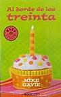

Al borde de los treinta, de [Mike Gayle](http://www.mikegayle.co.uk/) \[[Casa del libro](http://www.casadellibro.com/fichas/fichabiblio/0,1094,2900001112978,00.html?codigo=2900001112978&titulo=AL+BORDE+DE+LOS+TREINTA), [Fnac](http://www.fnac.es/dsp/?servlet=extended.HomeExtendedServlet&Code1=2109003155&Code2=154&prodID=595087)\]

No es lo que suelo leer. El best-seller facilón siempre ha sido algo que me supera, y trato de huir de ellos como de la peste. Si el nombre del autor está escrito en la portada más grande que el título del libro, queda descartado generalmente. No es el caso, pero me apetecía desvariar un poco. Los libros con portadas en color chicle quedan descartados también, y este sí es el caso. Son los que suelen estar en esos stands circulares ridículos en supermercados de barrio y similares. De hecho lo compré en un Supersol, y creo que con eso ya lo digo todo.

¿Por qué? Pues porque el título era obvio que iba a llamarme la atención, y al leerme la sinopsis lo primero que pensé es que alguien había escrito mi vida y estaba ganando dinero con ello. Un informático cerca de los treinta que se encuentra en un momento en el que le parece que todo le va bien, hasta que rompe con su novia, deja su trabajo en una multinacional y se va a vivir un tiempo con sus padres. No necesariamente por ese orden, pero creo que más o menos sigue siendo igual que mi vida.

Así que lo compré y lo leí en un par de días. Está bastante bien, literatura de consumo rápida y fácil. Sentido del humor al estilo de una comedia de [Hugh Grant](http://www.imdb.com/name/nm0000424/), y poco más que reseñar. Pero como el tema hace gracia a poco que te veas identificado, pues creo que voy a atreverme a recomendarlo. Incluso pese a que sé que la ya deplorable imagen que cualquiera puede tener de mí cae varios puntos con esto. 