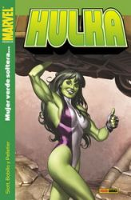

")Estamos a viernes, así que publicar ahora la "recomendación del lunes" pilla un poco a desmano... ya tenía decidido el tema desde el fin de semana pasado pero no había encontrado tiempo libre. La verdad es que ahora mismo tampoco lo tengo, pero me está entrando la modorra siestera del viernes por la tarde y como no puedo rendir mucho en el trabajo, al menos dejo que mis pensamientos fluyan...

Y centrándonos en el tema: ¿Qué? ¿[Hulka](http://en.wikipedia.org/wiki/She-Hulk)? ¿Has perdido definitivamente el norte, Iván? Un tebeo de la copia femenina de Hulk... Sí, he perdido definitivamente el norte. Es uno de los tebeos más divertidos que pueden comprarse en estos momentos (si es que van a seguir editándolos, cosa que desconozco). [Dan Slott](http://en.wikipedia.org/wiki/Dan_Slott), a quien acabo de descubrir, parece que se ha ganado con creces todas las buenas críticas que había leído de su obra. Conste que sólo he leído por ahora el primer tomo de nuestra abogada verde favorita.

Hulka es una vengadora fiestera. Su novio (un modelo de ropa interior) decide romper con ella porque es "superficial". [Los Vengadores](http://en.wikipedia.org/wiki/Avengers_%28comics%29) le piden amablemente que abandone la mansión, que no está sólo para hacer fiestas. Y la despiden del trabajo por perder su último caso. A todos nos puede pasar...

Tras esta debacle, deciden contratarla en el más reputado bufete de la costa este, en su nueva división de asuntos superhumanos, con la condición de que trabaje con su identidad "humana", sin mezclar a Hulka en todo el asunto (recordemos que se diferencia de su "colega" masculino en que ella controla a voluntad sus transformaciones). Es bastante impresionante ver cómo el guionista es capaz de contarnos historias verdaderamente interesantes sin necesidad de llenar las páginas de peleas de tipos en pijama (que también las hay, claro). El juicio en el que [Spiderman](http://en.wikipedia.org/wiki/Spiderman) denuncia a [Jameson](http://en.wikipedia.org/wiki/J._Jonah_Jameson) por difamación es impagable.

Los primeros números están dibujados por Juan Bobillo, que se ajusta a la perfección a una serie con este tono humorístico. Los últimos por desgracia están dibujados por alguien de corte más "clásico" (como un mal Byrne), que es Paul Pelletier. Y esas grandiosas portadas de [Adi Granov](http://en.wikipedia.org/wiki/Adi_Granov)... 

Por dejaros unos enlaces, os dejo con [lo que opina Álvaro Pons](http://www.lacarceldepapel.com/indexblog.php?p=1339) \[[La cárcel de papel](http://www.lacarceldepapel.com/blog.html)\] o lo que decían de Dan Slott en "[Es la hora de las tortas](http://www.eslahoradelastortas.com/?p=2382)".

Como podéis ver en las imágenes, los tomos que publica Panini son feos... pero feos, feos. Alguien debería demandarles, por mal gusto.