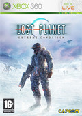

Ayer no hubo recomendación del lunes porque las temibles hordas invasoras del consumismo me atraparon en la cola de cajas del [Media Markt](http://www.mediamarkt.es/). Parecía el metro en hora punta. Las colas daban la vuelta sobre sí mismas, convirtiéndose en una especie de [botella de Klein](http://en.wikipedia.org/wiki/Klein_bottle) donde ya no había diferencia entre quién estaba dentro y quién fuera de la cola.

Lo peor de todo es que no iba a comprar nada, pero acompañé a un amigo "por si encontraba algo"...

Primera temporada de [Prison Break](http://www.tv.com/prison-break/show/31635/summary.html), mando inalámbrico (oficial, por supuesto) de XBox 360, [Lost Planet: Extreme Condition](http://en.wikipedia.org/wiki/Lost_planet) y [Ninety Nine Nights](http://en.wikipedia.org/wiki/Ninety-Nine_Nights). Qué forma más curiosa de hacer desaparecer dinero.

Ya os contaré algo sobre los juegos cuando tenga tiempo de probarlos, que será aproximadamente cuando vuelva a pasarme el primer [Halo](http://en.wikipedia.org/wiki/Halo:_Combat_Evolved). Lo de rejugar un videojuego es algo que hago rara vez, pero éste lo merece. Además, el paso de 14 a 42 pulgadas se hace notar. Ya casi ni recuerdo nada del juego, de hecho creo que aún no he llegado ni a la mitad (que debe ser aproximadamente la liberación de [los Flood](http://en.wikipedia.org/wiki/The_Flood_%28Halo%29)), pero debo andar cerca.

Después del Halo vendrán estos juegos (empezando muy probablemente por Lost Planet, que la demo me pareció increíble), y después [Halo 2](http://en.wikipedia.org/wiki/Halo_2). Espero haber comprado para entonces alguna edición internacional en inglés, porque no me apetece volver a jugar a la edición "neutra" del "nesesito un arma".
