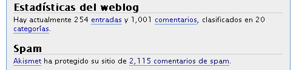

Es un número como cualquier otro, pero yo es que me ilusiono con muy poca cosa. Concretamente ha sido [este comentario](https://neverbot.com/filosofia-practica-para-mentes-jovenes-ii/#comment-3098) en [este post](https://neverbot.com/filosofia-practica-para-mentes-jovenes-ii/).

Teniendo en cuenta que es una página más bien personal donde la práctica totalidad de los comentaristas suelen ser personas a quien también conozco en el Mundo Real™, pues entonces supongo que sí es un número bastante decente. Y máxime teniendo en cuenta que durante el último mes el ritmo de actualización ha descendido bastante, en parte por "culpa" de mi nuevo trabajo. Pero poco a poco intento recuperarlo. Este lunes no hubo "recomendación del lunes", por ejemplo, tengo que solucionar eso aunque sea con retraso.