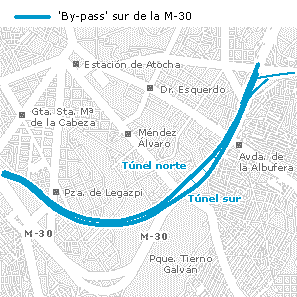

Hoy he cogido el bypass sur de la M30 (esto para quienes no vivan en Madrid, aparte de que no les interesará, no sabrán ni de qué hablo). Ahorro unos 15 minutos respecto al trazado antiguo, porque me salto el nudo sur que está en dura pugna por ser uno de los tramos de carretera peor diseñados de la historia.

Desgraciadamente en cuanto termina el bypass y sales a la superficie te encuentras con un atascazo monumental, aunque por suerte son sólo unos minutos porque en apenas dos salidas está la calle Alcalá que es mi destino final.

Y con esta tontería y una imagen ya tengo arreglado el post del día.