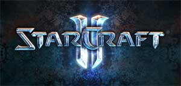

Al final el juego presentado en Korea fue el esperado, [Starcraft II](http://eu.starcraft2.com/). Y sé que todos me diréis que no tengo criterio, pero la verdad es que es un juego que me deja frío y que me llama bastante poco la atención. Tendré que ver más videos, pero no le veo tantas diferencias con respecto a la primera parte.

Claro que, por otra parte, Halo 3 será básicamente igual que los anteriores (como si lo viera venir) y eso no quitará para que juegue. Así que los fans de StarCraft estarán que no entran en sí de gozo, alborozo y algarabía. Cada uno es fan de lo suyo.

Gráficamente no parece nada del otro mundo, pero siendo de Blizzard podremos asumirle una gran jugabilidad y un buen balanceo de las unidades, que digo yo que al menos de juegos de estrategia entienden un poco.

Vía [La Zona Oscura](http://www.lazonaoscura.com/drupal/?q=node/1309), que de este tipo de juegos saben un poco más que yo. Tienen enlaces a varios vídeos de YouTube, por si queréis echarles un vistazo.