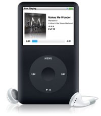

Estoy pensando (bastante seriamente) en comprarme [esto](http://www.apple.com/ipodclassic/).

Puede que existan otras opciones algo más baratas (aunque unos 250 euros por 80 GB no me parece un precio demasiado caro). Lo que no sé es si existen otras posibilidades con las mismas opciones de uso (en el sentido de usabilidad, diseño de interfaz, etc, etc).

Los nuevos [Sony Walkman mp3](http://www.sony.es/view/ShowProductCategory.action?site=odw_es_ES&category=NWS+A+Series) ofrecen sólo 4 GB por casi 200 euros. Son mucho más pequeños pero más caros y me gustan menos. Los [reproductores de Creative](http://es.europe.creative.com/products/welcome.asp?category=267) no me llaman mucho estéticamente, pero si sabéis de alguno concreto que merezca la pena pasadme algún enlace. Esto se hace extensible para cualquier marca, claro está.

No sé. Any idea? Comentarios del estilo "el iPod es sólo para pijos blablabla" abstenerse. Eso ya lo sé y es otra de las razones por las que me gusta, porque es una pijería de lo mas cool/trendy. No, en serio, he usado varios modelos de reproductores de mp3 y la usabilidad de los iPod está muy por encima de los demás, seamos honestos. Si me convencéis de lo contrario que sea con algún argumento convincente, por favor.