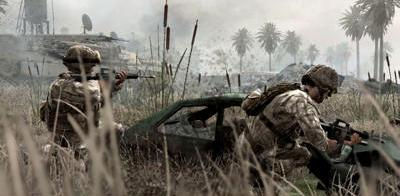

Ayer trabajé, hice la compra y llegué a casa. Decidí seguir probando un poco más el recién adquirido [Call of Duty 4](http://en.wikipedia.org/wiki/Call_of_Duty_4:_Modern_Warfare), quizá probar un nivel durante media hora y después hacerme la cena y dormir. Cuatro horas y pico después miré el reloj y decidí que había que madrugar.

He de decir que hasta el tutorial de entrenamiento es emocionante. El primer nivel en el barco ya muestra cómo va a ser el juego, pero es que hay momentos como el rescate de la piloto del helicóptero Cobra, la explosión nuclear, la toma del pueblo buscando a Al-Asad o el ya famoso en internet "**nivel de los francotiradores™**" que... bueno. Hay que jugarlo. De todo lo que he probado hasta ahora es con diferencia el mejor juego de esta generación.

Gráficamente espectacular y con una jugabilidad que deja en ridículo a muchos otros juegos. Argumentalmente brillante, demostrando que incluso con un [FPS](http://en.wikipedia.org/wiki/First-person_shooter) se pueden tener tantos giros narrativos y tantas situaciones jugables distintas que es imposible que el juego se haga aburrido.

Mucho tendría que empeorar en lo que me queda para que mi impresión cambiara. Mientras tanto: **We leave no man behind!**