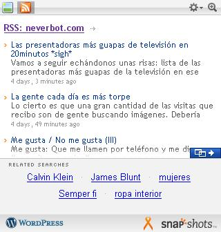

[SnapShots](http://www.snap.com/) es un servicio que asocia a los enlaces pequeñas capturas de pantalla de la dirección de destino, o vistas previas de su [feed Rss](http://en.wikipedia.org/wiki/RSS), o cosas similares. Esto es lo que opina de **neverbot.com**:

Calvin Klein, James Blunt, mujeres y ropa interior. De eso parece que trata esta página.