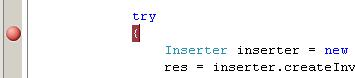

No sé cómo ha llegado ahí. No debería poder estar ahí. No puedo quitarlo. Creo que mi Visual Studio está empezando a tomar consciencia de sí mismo. ¿Por qué hay un breakpoint en una línea en la que el código no puede pararse? Si sólo hay una llave, por el amor de... \*sigh\*