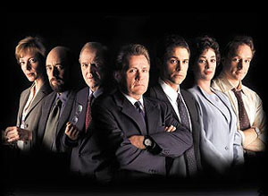

Nueva serie de posts para manteneros entretenidos: personajes de series de ficción que me hubiese gustado ser, pero no soy. En nuestro primer capítulo: [The West Wing](http://www.tv.com/the-west-wing/show/189/summary.html) (El ala oeste de la casa blanca). Con permiso de Urgencias, la serie más injustamente maltratada en la parrilla televisiva española.

La plantilla de la primera temporada. Sam Seaborn es el tercero por la derecha.

**¿Quién es?** [Sam Seaborn](http://en.wikipedia.org/wiki/Sam_Seaborn), Asistente del director de comunicaciones de la Casa Blanca. **¿Quién lo interpreta?** [Rob Lowe](http://www.imdb.com/name/nm0000507/), en el único buen papel de su vida si me apuras. **¿Qué hace?** Escribir los discursos del presidente y añadir un pequeño punto revolucionario en las ideas que se discuten. **¿Por qué me gusta la serie?** Porque, hasta hoy, es la única serie sobre política que me parece mínimamente creíble. Y la verdad es que no, no es una "americanada" como casi todo el mundo cree. **¿Por qué me gusta el personaje?** Porque es uno de los más jóvenes, porque nunca está conforme ni con su propio trabajo y porque es probablemente el más impulsivo de los protagonistas.

Creo que ya tengo decididos los otros cuatro, pero cualquier comentario es bienvenido.
