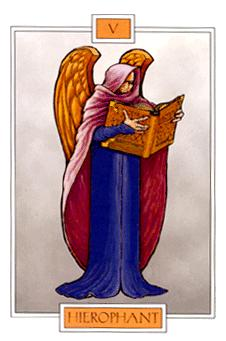

**You are The Hierophant**

> Divine Wisdom. Manifestation. Explanation. Teaching.
> 
> All things relating to education, patience, help from superiors. The Hierophant is often considered to be a Guardian Angel. The Hierophant's purpose is to bring the spiritual down to Earth. Where the High Priestess between her two pillars deals with realms beyond this Earth, the Hierophant (or High Priest) deals with worldly problems. He is well suited to do this because he strives to create harmony and peace in the midst of a crisis. The Hierophant's only problem is that he can be stubborn and hidebound. At his best, he is wise and soothing, at his worst, he is an unbending traditionalist.

Por si no sabéis qué carta es: El hierofante en la wikipedia \[[español](http://es.wikipedia.org/wiki/El_Hierofante_(Tarot)), [inglés](http://en.wikipedia.org/wiki/The_Hierophant)\].

[¿Qué carta del tarot eres?](http://www.flarn.com/~warlock/tarot)

Vía: [A place to call my own](http://blog.crisopeya.eu/)