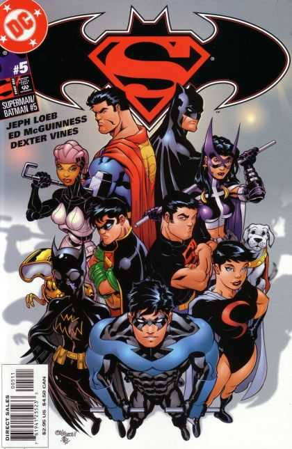

En la película [Soy Leyenda](http://en.wikipedia.org/wiki/I_Am_Legend_(film)), ambientada en el año 2012, cuando Will Smith pasea por Nueva York pueden verse carteles promocionales de una ficticia película con el logotipo de [Superman/Batman](http://en.wikipedia.org/wiki/Superman/Batman), la serie de cómic que tiene como protagonistas a los dos personajes. Gran logo, por cierto.

Portada del Superman/Batman #5, por [Ed McGuinness](http://en.wikipedia.org/wiki/Ed_McGuinness)

En la wikipedia, tanto la entrada de [Superman](http://en.wikipedia.org/wiki/Superman) como la de [Batman](http://en.wikipedia.org/wiki/Batman) utilizan como ilustración de cabecera portadas de las sagas de ambos personajes dibujadas por [Jim Lee](http://en.wikipedia.org/wiki/Jim_Lee). Grande entre los grandes.
