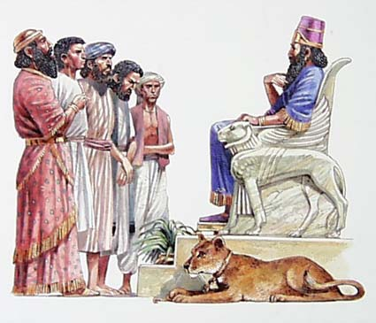

Pensaba que me iba a tocar algo un poco más... extraño, pero la verdad es que creo que han acertado bastante.

**King Nebuchadnezzar**, es decir, Nabucodonosor II \[ver wikipedia [en inglés](http://en.wikipedia.org/wiki/Nebuchadnezzar_II) o [en castellano](http://es.wikipedia.org/wiki/Nabucodonosor_II)\].

Coincido en nombre con [una de las leyendas de Magic](http://www.evocacion.com/nebuchadnezzar-c19229.html) (expansión Legends si no recuerdo mal) y con la nave de Morfeo en Matrix.

> You are King Nebuchadnezzar, the emperor of Babylon. You are part of a long tradition of Middle Eastern dictators. Like any good dictator, you possess the attributes of pride and ambition in good measure. Your ambitious nature drove you to conquer much of the Middle East, including the kingdom of Israel. You subsequently put the people of Israel into bondage. You also tend to be very direct with your friends and enemies alike. You prefer to tell people exactly what you're going to do and how you're going to do it. Your position in society and your imperial army give you the ability to do this with impunity. Unlike many Middle Eastern despots, you are a very good ruler and you happen to treat your own people quite well. You might be a biblical villain, but I'm sure you'd make a good dictator in the 21st century, if given the chance.

Test de [OkCupid.com](http://www.okcupid.com/tests/10531125146878970544/Which-Biblical-Villain-Are-You), encontrado vía [Rojo fuego de la sangre](http://lawbug.blogspot.com/2007/09/que-villano-biblico-soy.html).