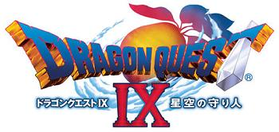

Aunque es algo que se sabe desde una conferencia del 12 de diciembre pasado (ha llovido ya), no había escrito nada sobre el tema... sobre todo porque en esta tontería de blog que mantengo no sé muy bien por qué no suelo hablar con un mínimo de tranquilidad sobre nada.

El caso es que la próxima iteración de la franquicia es exclusiva de Nintendo DS... Whoa! ¿Para una portátil? Sí, para una portátil. Y no se trata de un remake, ni de un spin-off, sino de una continuación directa, según tengo entendido. Aparecerá en Septiembre o Noviembre de este año y [algunos analistas](http://www.bloomberg.com/apps/news?pid=email_en&refer=asia&sid=a2Dv8ZS0zIbc) estiman la cifra de cinco millones de unidades a vender en Japón.

Teniendo en cuenta que estas cifras de ventas [sólo las han alcanzado anteriormente](http://www.dsfanboy.com/2008/06/03/analyst-dragon-quest-ix-to-sell-5-million-in-japan/) productos first-party (de la propia Nintendo) como Pokemons y Super Marios, conseguir esto siendo una Third-Party como es Square-Enix sería todo un logro.

¿Por qué hacer esto ahora? La primera respuesta es obvia: los gastos de desarrollo de un juego **triple A** a día de hoy son prácticamente inabordables. Con juegos que gastan el 50% de su presupuesto "simplemente" en marketing (no quiero saber las cifras de GTAIV), los números se suben a muchos, muchos millones. El desarrollo de un juego de DS es más barato, más corto y más simple. Y al final la experiencia de juego no es muy distinta de la que se puede conseguir en una plataforma mayor. Con menos dinero vendes muchos juegos y puedes ingresar (al menos proporcionalmente) más dinero.

Esa es la razón obvia, por supuesto, pero me parece que hay una segunda que no deberíamos olvidar, y es que Enix ya no es independiente. Ahora son **Square-Enix**, y eso significa que la misma empresa tiene las dos mayores franquicias de J-RPGs (Final Fantasy y Dragon Quest). Teniendo en cuenta que la parte square de la empresa ha perdido completamente el norte: tras unos diez primeros juegos desarrollados a un ritmo concreto, con sólo un juego por iteración, últimamente hemos llegado al momento de exprimir (y matar, muy probablemente) a la gallina de los juegos (qué buen chiste) de oro. Ya les he perdido la cuenta, pero ahora mismo creo que tienen más de media docena de juegos en producción con el nombre Final Fantasy en algún lugar de la carátula, para distintas plataformas, con distintos géneros, algunos remakes, algunos continuaciones, algunos independientes.

Y si la empresa ya está haciendo eso, y ya estará (asumo) desarrollando el siguiente Final Fantasy "grande"... ¿para qué competir contra ellos mismos? Sacamos Dragon Quest de una escalada de gastos económicos que no nos lleva a ningún sitio, desarrollamos con tranquilidad para DS... y a vender.
