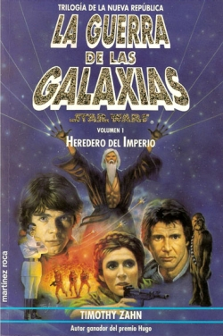

> Asumamos las cosas bien claras desde el principio: **últimamente no hago más que leer mierda**. Pero tenía unos cuantos libros a medias desde hacía años y no me gusta dejarlos así. Bien es cierto que la vida es corta y hay muchas cosas por hacer (entre ellas leer algo bueno), pero en el caso de Reinos Olvidados [el último libro](/el-legado-de-rasalvatore/) ha servido para cancelar mi necesidad de seguir sabiendo algo más de la saga, así que quizá consiga lo mismo si termino de leer algunos de los pendientes.
>
> Siempre me estoy excusando por leer este tipo de cosas, como si quisiera que no pensárais que no tengo cultura... a ver, **a veces son libros divertidos**, y punto. También he leído hace poco [¿Quién se ha llevado mi queso?](http://en.wikipedia.org/wiki/Who_Moved_My_Cheese%3F) y no os castigo hablando del él. Aunque bien pensado... me lo dejo apuntado para escribir algo al respecto.

**Centrando ideas**: Hace... qué sé yo, quizá diez o quince años, leí los dos primeros libros de esta trilogía, que fueron los primeros en continuar la historia de [La Guerra de las Galaxias](http://en.wikipedia.org/wiki/Star_wars) allí donde terminó el episodio VI ([El Retorno del Jedi](http://en.wikipedia.org/wiki/Star_Wars_Episode_VI:_Return_of_the_Jedi)). Dejan un hueco de pocos años (que posteriormente fue llenado con más novelas) y continúan contándonos lo que les sucedió a los protagonistas y a la galaxia entera.

Hace un par de años conseguí en una tienda de segunda mano el tercer libro (por descontado que la trilogía entera está más que descatalogada, hace mucho que **Martínez Roca** no tiene los derechos de estos libros), y lo dejé a medias. Ahora ya está terminada.

[Esta trilogía](http://en.wikipedia.org/wiki/Thrawn_Trilogy) de [Timothy Zahn](http://en.wikipedia.org/wiki/Timothy_Zahn) comenzó la construcción de lo que posteriormente se conoció como el [Universo Expandido](http://en.wikipedia.org/wiki/Star_Wars_Expanded_Universe), historias no canónicas (en el sentido de que únicamente se consideran canon las películas de **George Lucas**... desgraciadamente), pero sí "suficientemente canónicas" como para construir el entorno donde todo sigue considerándose "oficial": cómics, videojuegos, novelas y juegos de rol y cartas. Las publicaciones de cualquiera de estas cosas son utilizables para las demás, de ahí que [LucasFilm](http://en.wikipedia.org/wiki/Lucasfilm)/Arts/Games (como se llame ahora cada empresa del emporio) suela controlarlas bastante.

Cinco años después de la destrucción de la segunda Estrella de la Muerte, y de la desaparición de Vader y el Emperador, la Nueva República está tratando de afianzarse. Los restos del Imperio, repartidos por la galaxia, han sido reunidos bajo el mando del [Gran Almirante Thrawn](http://en.wikipedia.org/wiki/Grand_Admiral_Thrawn). Han Solo y Leia Organa se han casado y esperan gemelos. Luke sigue en su camino para convertirse en el primero de una nueva estirpe de Caballeros Jedi. Bla, bla, bla...

Si os gustaron las películas (las originales, claro) esto sigue en la misma línea. Thrawn es un villano a la altura de los anteriores (**y eso es decir mucho**). [Talon Karrde](http://starwars.wikia.com/wiki/Talon_Karrde) y [Mara Jade](http://starwars.wikia.com/wiki/Mara_Jade) -la mano del Emperador- son personajes nuevos que posteriormente tendrán una enorme importancia en la historia de la Galaxia y en las siguientes novelas. Aparece un nuevo Jedi caído al lado oscuro. Llegarán al mundo Jacen \[\*\] y [Jaina Solo](http://starwars.wikia.com/wiki/Jaina_Solo), los gemelos Jedi.

¿Qué más se puede pedir? ¿Son libros malos? Pues mayormente sí... pero voy a pedir algunos más a Amazon (desisto de encontrarlos en castellano, porque probablemente nunca se editaron) y a ver si puedo llegar hasta la saga de la [Nueva Orden Jedi](http://starwars.wikia.com/wiki/The_New_Jedi_Order) y la invasión [Yuuzhan Vong](http://starwars.wikia.com/wiki/Yuuzhan_Vong).

Si es que parece que nunca aprendo...

\[\*\] A este no os puedo poner enlace, sólo con ver su nombre en la [Wookiepedia](http://starwars.wikia.com/wiki/Main_Page) os estaría jorobando la historia futura del personaje. Yo os he avisado.
