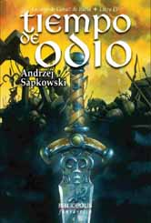

Cuarta entrega de la saga de Geralt de Rivia, editada por [Bibliópolis Fantástica](http://www.bibliopolis.org/editorial/bibliofan/tiempoodio.htm) (y, dentro de poco, reeditada por [Alamut](http://www.alamutediciones.com/alamut/), supongo).

Aunque ya estaba en el mercado (y en mi pila de libros pendientes) desde hace varios años, aún no lo había empezado. La razón: son siete libros pero el último aún no está editado en castellano, pese a llevar escrito en polaco mucho tiempo y a los años que han pasado desde la edición de la sexta parte (que también tengo, así como la quinta, aún sin leer).

Razones: el editor dice que la lentitud del traductor. **No me lo creo**, pero cada uno que piense lo que quiera. Por un tema de contrato en exclusividad con la distribuidora de Bibliópolis Fantástica, su dueño se ha montado una segunda editorial paralela (Alamut) para poder distribuir con otra empresa. Quizá con una mayor tirada, distintos puntos de venta final o simplemente con distintas condiciones. **Apostaría a que el libro lleva traducido mucho tiempo** pero no aparecerá en castellano hasta que Alamut llegue a la reedición del sexto libro. Supongo que el hecho de tener una única saga con capacidad para sostener una colección como Bibliópolis hace que quieran estirar lo máximo posible las ventas y la "expectación" por el último libro... hasta que salga al mercado y entonces la suerte de la colección penda exclusivamente de las reediciones y de algún éxito puntual. **¿Miedo a la desaparición?** Quién sabe. Puedo estar columpiándome, como hago habitualmente, pero la verdad es que tener un único libro pendiente de publicación durante años mientras siguen sacando otros... y de repente montar otra editorial paralela... algo huele a podrido en Dinamarca.

**En cuanto al libro**: pues que está bien, como todos. Pero no termina, como todos. Y los libros que no terminan me parecen un timo. Creo que se puede escribir todo en un único libro sin meter paja entre medias. La situación, digamos, social, del mundo de Geralt cambia mucho durante este volumen, pero no así los personajes... aparecen muchos secundarios que van y vienen y me da toda la impresión de que, cuando termine la saga (si lo podemos hacer algún día) pensaré que **he leído mucha paja que sobraba** durante muchas páginas. Parece que pasan muchas cosas entre los personajes, que avanzan, que cambian... y al final del libro todo vuelve a estar más o menos en el mismo lugar que al principio. Paja bien contada, pero paja al fin y al cabo.

**Actualizado**: de hecho [en este post](https://neverbot.com/libros/un-apunte-rapido/) está la fecha en la que apareció la sexta parte. Hace año y medio de eso, y ya se publicó con mucho retraso en su momento.