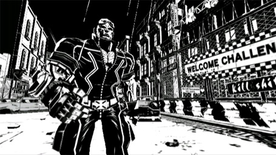

Hoy he visto por primera vez [en movimiento](http://www.anaitgames.com/gc-08-trailer-de-madworld/) el juego [MadWorld](http://en.wikipedia.org/wiki/MadWorld) (**de Sega**, para Wii, juego que hará temblar las frágiles mentes de los wii-jugadores por ver en su inmaculado juguete litros y litros de sangre). Estoy pensando lo mismo que ya pensaba al ver imágenes estáticas. Este juego se la va a dar.

La estética en blanco y negro tan exagerada (un estilo [Sin City](http://en.wikipedia.org/wiki/Sin_City)) está bien en papel, pero en movimiento no se ve un carajo, y me marea.

Trailer [vía AnaitGames](http://www.anaitgames.com/gc-08-trailer-de-madworld/).