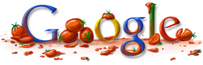

Logo de Google para [La Tomatina](http://en.wikipedia.org/wiki/Tomatina) de este año... yo empiezo a pensar que la política de diseño de logos está empezando a perder sentido.

Los logotipos especiales de Google los diseña una única persona, [Dennis Hwang](http://en.wikipedia.org/wiki/Dennis_Hwang), aunque asumo que algunos logos son únicamente locales a determinados países (como este de la Tomatina), y no creo que lleguen a verse desde fuera. En muchos sitios he visto algunas colecciones de logos de Google, pero bastante incompletas y, desde luego, sin incluir las personalizaciones internacionales.

El primer logo personalizado fue para el día de la Bastilla (14 de Julio) del año 2000, y desde entonces se han diseñado decenas y decenas, de los que podéis ver algunos [en esta página](http://www.google.com/holidaylogos.html) de la propia Google.
