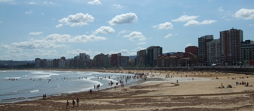

Asumámoslo. Es una tontería inventada por los medios de comunicación modernos **para mantener a la gente feliz y contenta**, pensando que la misma miseria que embarga su vida es compartida por sus congéneres, y que, por tener un nombre, es algo aceptable.

**Mentira**. El verdadero problema radica en que, tras unas vacaciones felices, la gente vuelve a la realidad diaria, y esa realidad no le gusta. El verdadero problema es que vuelve comprendiendo que desearía estar en otro lugar, haciendo otras cosas con otra gente.

La revolución industrial cambió el mundo introduciendo algo muy novedoso, que era el trabajo con horarios. Y **los horarios implican tiempo libre**, implican tener tiempo que necesitas gastar con algo, bien sean tu familia, tus aficiones o la barra de un bar. Y el mundo moderno, donde todo está globalizado, nos enseña que existen otros modos de vida, que hay gente a quien su trabajo le gusta, empresas que entienden el concepto de compatibilizar horarios, parejas y familias que viven felices, sueldos que te permiten tener caprichos capitalistas y un largo etcétera que dependerá de la forma de cada uno de definir la felicidad.

El caso está en que ahora estamos capacitados para darnos cuenta de que existen (o deberían existir en algún lugar) formas mejores de vivir que las nuestras. Durante nuestras vacaciones podemos atisbarlas y, a la vuelta, desaparecen.

**No es una buena práctica vivir semanas aburridas esperando a que llegue el viernes**. Tampoco es una buena práctica aguantar meses de hastío esperando que llegue la libertad del verano.

**Si crees que tienes síndrome post-vacacional háztelo mirar**, porque lo más probable es que simplemente estés viviendo una vida que no te gusta. Cámbiala. Quizá seas más feliz abriendo un bar en tu pueblo.