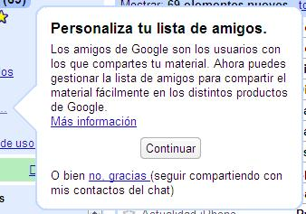

Al menos eso parece, porque hoy al abrir Google Reader me he encontrado con la posibilidad de compartir mis feeds con otras personas de mi lista de contactos de Gmail (pero especificando una lista distinta a aquellos con lo que puedes chatear).

Parece ser que ha ido sacando conclusiones acerca de con quién me escribo y con quién no, y ha empezado a sugerirme que comparta las suscripciones con un indeseable indocumentado que suele comentar por aquí.

**Actualizado**: Parece ser que el indeseable indocumentado se encontró con esta (aparentemente nueva) funcionalidad ayer, me añadió, y Google ha empezado a decirme cosas desde entonces. No son tan listos entonces.