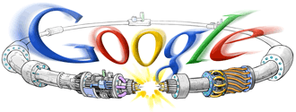
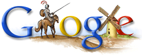

Este mes ha habido varias modificaciones de los logotipos de Google, una de esas chorradas que probablemente sólo me interesan a mí y a cuatro desequilibrados gatos más, pero tenéis que aguantarme.

El 10 de septiembre comenzaron los primeros ensayos de funcionamiento en el LHC (el colisionador de hadrones, alias "la máquina del fin del mundo"©™), y Google aprovechó para poner uno de sus logotipos personalizados:

El día de inicio del otoño:

Y hoy, 29 de Septiembre, aniversario del nacimiento de Cervantes:

