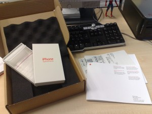

Siguiendo [el último post](/atencion-al-cliente-y-atencion-al-cliente/), en menos de 24 horas me ha llegado el paquete de Apple para recoger mi iPhone y enviarlo al servicio técnico. Dentro del paquete venía una caja de cartón con protección de poliuretano. Dentro de esta caja una de cartón rígido blanco y dentro de esta una bolsa acolchada con cierre autoadhesivo. **Espectacular**. Y una guía para saber qué hacer con todo esto y una bolsa de UPS convenientemente preparada con todos los datos para que pasaran a recogerla con el aparato dentro.

Click para verla en grande. Sí, al fondo hay una figura de Spiderman.

He llamado y antes de las cinco de esta tarde pasarán a recogerlo sin coste alguno para mí. Exactamente el mismo tipo de servicio que proporciona Movistar, vamos. Por ahora a Apple le sigo dando un **diez sobre diez** en atención al cliente.
