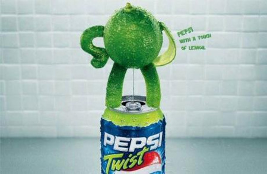
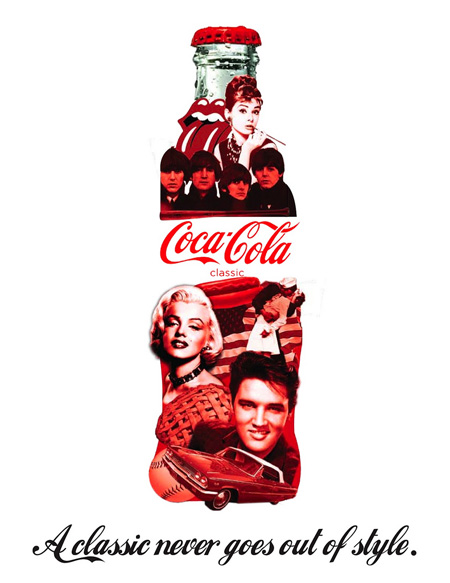

En [Toxel.com](http://www.toxel.com/) me encuentro con un par de **colecciones** curiosas de anuncios de _bebidas gaseosas de extractos con sabor a cola_ (\*sigh\*): [Coca-Cola](http://www.toxel.com/inspiration/2008/08/02/collection-of-cool-coca-cola-ads/) y [Pepsi](http://www.toxel.com/inspiration/2008/07/31/collection-of-cool-pepsi-ads/).

Imposible no recordar la campaña de **Pepsi Twist**... Pepsi siempre tuvo anuncios más transgresores (o eso pretendían), aunque hace tiempo que ya no se publicita. _¿Habrán dado a España por perdida como potencial consumidor?_

Y Coca-Cola, que a veces abusa del triple efecto: _aquellos maravillosos años_ + navidad + _vivamos todos en paz y armonía_. Un ejemplo de _aquellos maravillosos años_ intentando explotar una nostalgia de unos tiempos que la mayoría de los consumidores no han vivido:

Los Rolling Stone, [Audrey Hepburn](http://en.wikipedia.org/wiki/Audrey_Hepburn) (juraría que en _Desayuno con diamantes_), los Beatles, Marylin, el hotdog y la bandera americana, el American Pie, Elvis, una bola de béisbol, un coche que (asumo) será un Cadillac y la foto _The Kiss_ de [Alfred Eisenstaedt](http://en.wikipedia.org/wiki/Alfred_Eisenstaedt). Creo que no es posible insertar más estereotipos y clichés en un único anuncio.

Pero oye, los anuncios de Coca-Cola también molan...