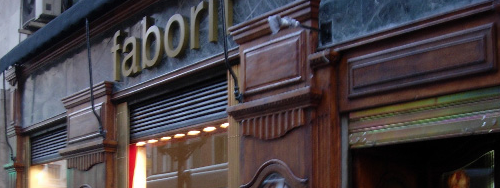

_Fotografía sacada de la web de la cafetería._ {.center}

Hace unos días **pasaba por el centro** (de Madrid, se entiende) para hacer unas compras y subía por la calle San Bernardo, cuando ví que en semiesquina con Gran Vía han abierto un **[faborit](http://www.faborit.com)** \[_horrible web en flash_\]. Es una cafetería *en plan cool* y me sorprendió bastante el escaparate.

Se trata de la típica barra en la que te puedes sentar pero mirando hacia la calle. El local debe disponer de Wifi para los clientes y... todos los que estaban sentados en la barra utilizaban un Mac. **En vez de una cafetería parecía un Apple Store**.