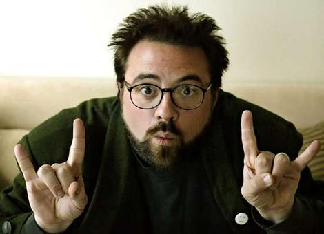

Tras haber visto ayer **¿Hacemos una porno?** ([Zack & Miri make a porno](http://www.imdb.com/title/tt1007028/), de Kevin Smith), me encuentro hoy con una serie de artículos sobre la [Nueva Comedia Americana](http://www.miradas.net/2009/04/estudios/nca.html) en miradas.net, donde incluyen un [artículo dedicado al director](http://www.miradas.net/2009/04/estudios/kevin-smith.html). Serendipia se diría.

No tengo mucho que añadir al tema, aparte de lo que ya incluía en los comentarios de [un post de H.](http://www.moleculasinestables.com/archivo/la-cancion-de-zack-y-miri/) en **moléculas inestables**, aunque allí el tema era la historia sobre la canción de fondo en una escena concreta de la película (grandísima secuencia, si se me permite puntualizar). Amplío mis aportaciones originales:

1.  [Kevin Smith](http://www.imdb.com/name/nm0003620/) es un directorazo cuando se pone… no entiendo su fijación en la comedia a medio camino entre el ñoñerismo romántico y el humor escatológico más zafio, cuando en ocasiones muestra algunos detalles que me hacen estar seguro de que este tio sería candidato al Oscar si hiciera una película de estudio grande. Lo cual no tiene que ser necesariamente bueno, pero me sorprende que sea el único de "su promoción" que no se haya vendido al vil metal y siga en su línea.
2.  Burbujas es [Traci Lords](http://en.wikipedia.org/wiki/Traci_Lords). Por si alguien no se había dado cuenta.
3.  [Seth Rogen](http://www.imdb.com/name/nm0736622/) es grande, grande: nominado al Emmy como escritor de Da Ali G Show, coproductor de Virgen a los 40, guión y producción de SuperSalidos, y ha actuado y producido más comedias que no han llegado a España (que debería ver, por cierto), ha hecho voces en KungFu Panda y Monstruos contra Alienígenas, y es coprotagonista en la próxima de Adam Sandler, Funny People, que no tiene mala pinta.

Desgraciadamente, no sé si por estar haciéndome mayor (más mayor, quiero decir), o por la influencia de mi medio tomate, que no disfruta demasiado de este tipo de humor (es capaz de pasar por el primer cuarto de hora de Ali G sin una mínima sonrisa), veo que este tipo de películas tienen cada vez más complicado sacarme la carcajada... **FanBoys casi (casi) consigue que la dejara a medias**.

Y hoy he recuperado el visionado de **Scrubs** (llego ya a la sexta temporada), serie reina del humor más que absurdo: **absurdérrimo**... y creo recordar que antes me gustaba más. ¿Me hago viejo?