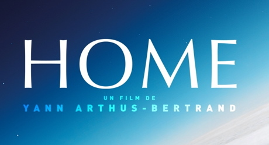

Tras haber visto ayer [Home, el documental de Yann Arthus-Bertrand](http://www.home-2009.com) \[[wikipedia](http://en.wikipedia.org/wiki/Home_(documentary))\] (y de estar cerca, cerca de soltar la lagrimilla hacia el final), no puedo hacer otra cosa, en conciencia, que no sea **recomendarlo a todo el mundo**.

Se puede ver gratis en [su propio canal de Youtube](http://www.youtube.com/user/homeprojectES) (fue estreno gratuito mundial a través de Youtube), en Dvd (menos de cinco euros en fnac, opción que recomiendo) o Bluray (formato que me parece un timo).

De todas formas en el canal de Youtube, aunque puede verse en español, no es en castellano (es un español neutro que puede resultar muy forzado para algunos), mientras que **la versión comercializada cuenta con el doblaje** de [Juan Echanove](http://spanish.imdb.com/name/nm0248364/), que ayuda enormemente a meterse en la narración, por lo que vuelvo a recomendar la opción del Dvd.

El documental explora algunos recónditos lugares de la Tierra, analizando las consecuencias interconectadas de la explotación a la que la estamos sometiendo, todo ello rodado con unas **realmente espectaculares vistas aéreas** de todos los continentes.

Y, puestos a añadir, el documental se puede distribuir mediante una licencia Creative Commons y no tiene copyright. Todo son puntos a su favor.
