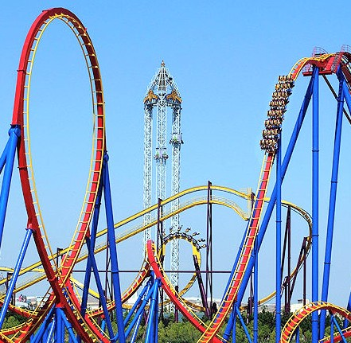
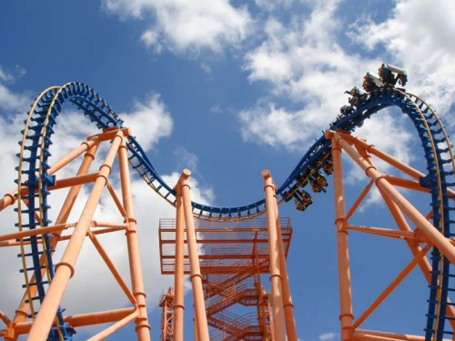

**Miedo me dan unas olimpiadas aquí** cuando ni algo como un parque de atracciones puede funcionar correctamente. Este fin de semana estuve en el Parque Warner, donde no había ido nunca desde su apertura hace ya unos cuantos años.

Desde la ciudad hay que conducir 28 kilómetros para llegar hasta las puertas (22 de la radial cuatro y otros seis de autovía hacia el este). La localización no me pareció especialmente buena, ya que a esa distancia del centro casi todo está vacío, y podría haberse escogido un lugar más cercano en kilómetros. Además está metido en un valle entre pequeñas colinas, lo que hace que no lo veas hasta que estás encima y, mucho peor, que no puedas ver nada alrededor ni cuando te subes a las atracciones, más que el inmeso secarral desértico en el que está construido el parque.

Partamos del hecho de que **Madrid me parece una elección errónea** de por sí: en verano la ciudad está relativamente vacía, y es el verano precisamente la temporada más fuerte de un parque de atracciones... sólo que Madrid ya tenía parque de atracciones, y dentro de la propia ciudad. _Port Aventura_ o _Terra Mítica_ están en zonas mucho más veraniegas y turísticas.

Podemos añadirle a esto el funcionamiento de nuestra ciudad con todo: el parking es de pago hasta para las motos (mínimo ocho euros por coche). La entrada de adultos son 37 euros, que se dice pronto. No se permite (en teoría) llevar tu propia comida (no hay merenderos, sólo restaurantes). Eso **pone el montante total por persona en una barbaridad de dinero** que hace que cualquiera se lo piense dos veces antes de ir.

Por nuestra parte intentamos contar con entradas _2 por 1_ antes de ir (las promociones eran externas, de un banco, pero suele haberlas de productos alimenticios, cadenas de turismo, _turyocio_ y similares), y metimos nuestra propia comida con la excusa de siempre de _"no te voy a enseñar lo que llevo en la mochila, me da igual cómo me lo digas"_. Es curioso, pero funciona.

Y una vez dentro me encontré con el problema principal del parque: tiene media docena de atracciones fuertes muy buenas, un montón de atracciones muy suaves de estilo infantil, pero **un cierto vacío de aquellas de nivel medio** en las que poder disfrutar junto con quienes pasan miedo en los lugares más agresivos. De hecho esta era la razón por la que en un principio era más reacio a ir al parque: el plan era en parejas y en varios casos media pareja quería las emociones fuertes y la otra media únicamente las más ligeras de todas las disponibles.

Al haber relativamente pocas de estas atracciones medias, estas solían tener colas bastante grandes, de igual modo que las orientadas a la familia al completo y/o las atracciones acuáticas, que además están repartidas de un modo muy desigual por todo el parque, con zonas donde únicamente hay atracciones infantiles, o donde sólo hay atracciones fuertes, o donde no hay más que zona de espectáculos durante cien metros, o grandes casetas de tómbolas que has de atravesar, etc, etc. **Muy mal diseñado en cuanto a interacción con el cliente**, muy al contrario que Port Aventura, donde todo está repartido. Nos pegamos unas pateadas tremendas de un lado a otro del parque varias veces para poder ir mezclando las cosas que queríamos hacer.

Y, por añadir una nota de color, algunos comentarios sobre **las atracciones que realmente me gustaron**: Hay tres montañas rusas clásicas: una de madera (que estaba cerrada) y dos de metal (de Batman y Superman), que están juntas en el mismo lugar... en vez de repartirlas por el parque. Muy divertidas las dos, [la de Batman](http://www.infocoasters.com/batman-la-fuga) algo más ligera pero muy muy rápida y de muchos giros y rizos veloces, y más agresiva, alta y más divertida [la de Superman](http://www.infocoasters.com/superman-la-atraccion-de-acero).

**Sobresaliente para las dos en cuanto a las sensaciones,  suspenso garrafal en cuanto a diseño**: la mitad de los viajes salen con varios asientos vacíos, por culpa de una mala gestión de la cola por parte del personal del parque, lo que provoca colas de más de media hora para las atracciones más fuertes, algo completamente impensable en cualquier otro parque de atracciones. Siendo realistas, las atracciones fuertes tienen relativamente poca gente que se "atreva" a montarse de entre el total de visitantes. En _Port Aventura_ subes al _Dragon Khan_ esperando menos de cinco minutos, mientras que aquí la espera es de al menos media hora (e incluso tienen montadas zonas de espera con lineales de varios cientos de metros, algo que no comprendo cómo pensaron que podía llenarse algún día en ningún caso). Esto además obliga a los acompañantes que no van a montar a esperar fuera, lo que al final se va uniendo a unas cosas y otras y el día pasa entre cola y cola.

En esas dos montañas rusas, ambas cuentan además con un único tren en todo el recorrido, en la elección más estúpida que puede comprenderse. En tren viaja, da la vuelta completa, vuelve a llegar, la gente baja, la gente sube, se comprueban todos los mecanismos de seguridad, y se vuelve a dar la salida. Siete pasos por viaje de los cuales sólo en uno la gente se está divirtiendo. Un andén más largo permitiría dos trenes, uno siempre parado y otro siempre en movimiento: mientras un tren hace el viaje, en el otro se bajan y se suben y se comprueban los mecanismos de seguridad. Cuando el primero se para tras entrar en el andén, el segundo da su salida, y estaríamos hablando de casi el doble de clientes por hora atendidos con una infraestructura prácticamente idéntica. Absurdo funcionamiento, aunque repito que, una vez montado en ellas, son dos de las atracciones que más me han gustado de toda mi vida atraccionil.

_En rojo la montaña de Superman, en Amarillo la de Batman, al fondo la Vengaza del Enigma en blanco. Foto de lanetro.com_

Bastante cerca también está el [Stunt Fall](http://www.infocoasters.com/stunt-fall-ida-y-vuelta), en la que monté por la mañana nada más entrar y es lo más brutal que probé en todo el parque. Por la tarde la cerraron para ponerla en pruebas (lo que no da mucha confianza) y me quedé con las ganas de repetir. Te suben en una pared vertical dejándote colgado y te sueltan mirando hacia el suelo y cayendo, lo que provoca una sensación de acongoje suprema y continúa con una serie de vueltas y más vueltas hasta que te paras... y repites todo el recorrido hacia atrás, terminando de nuevo colgado mirando hacia el suelo.

_El Stunt Fall, con la plataforma de evacuación que impide usar los asientos de la primera y última fila (desde ellos no se llega a la plataforma). Foto de [ThemeParkReview.com](http://www.themeparkreview.com/wbmw2006/wbmw4.htm)_

Y me quedé sin probar la _Venganza del Enigma_ (para los de Madrid, la lanzadera, casi el doble de alta que la del parque de atracciones), porque la estábamos dejando para el final pero estábamos todos demasiado cansados y acabamos yéndonos antes de probarla. Creo que tenemos un posible segundo día hasta septiembre por ocho euros, así que quizá vuelva después del verano para probarla. Ya os contaré.

Terminando, mis consejos para posibles visitantes:

*   De Asturias para abajo todo es desierto, así que gorra y crema solar son obligatorios.
*   Bañador para las atracciones acuáticas.
*   Planificad el orden en el que se quieren hacer las cosas antes de empezar a caminar, porque las distancias son mayores de lo que parece.
*   Meted la comida en mochilas, no las enseñéis en la entrada _os digan lo que os digan_ y dejadlas en el servicio de taquillas para volver a por ellas a la hora de comer.