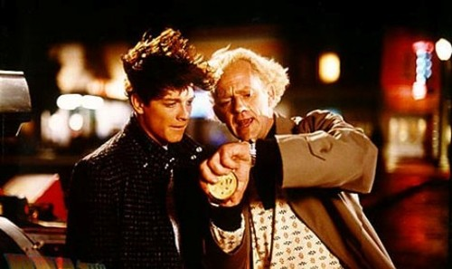

Una interesante conversación sobre cine sacó dos curiosos detalles sobre [Regreso al futuro](http://www.imdb.com/title/tt0088763/). El primero, que la película comenzó a rodarse con un protagonista diferente ([Eric Stoltz](http://www.imdb.com/name/nm0000655/)), y todo se volvió a rodar con [Michael J. Fox](http://www.imdb.com/name/nm0000150/) posteriormente:

> Eric Stoltz was originally cast for the role of Marty McFly in “Back to The Future”. In fact they shot for several weeks and with Stoltz before deciding that he was miscast. Director Robert Zemeckis finally was able to convince Michael J. Fox into doing the movie, and they worked on the film at nights and during the weekends, because of Fox’s obligations to “Family Ties”. Interestingly, you can see Eric driving the car in a few scenes if you keep your eyes peeled.

Y el otro, que no conocía, es que las actrices de la primera ([Claudia Wells](http://www.imdb.com/name/nm0920148/)) y segunda películas ([Elizabeth Shue](http://www.imdb.com/name/nm0000223/)) eran distintas, por lo que el final de Regreso al futuro se volvió a rodar plano a plano para el comienzo de la segunda película, con la nueva actriz:

> Because her mother was diagnosed with cancer, Claudia had to drop out of the two sequels and was replaced by Elisabeth Shue.
