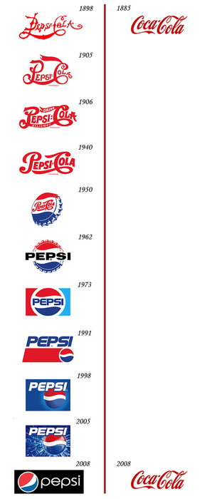
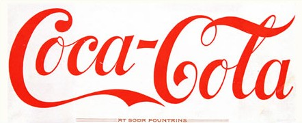

_Coca-Cola vs Pepsi_

Aunque el diagrama es divertido, lo cierto es que no es del todo cierto. Es lógico y obvio que Coca-Cola también ha ido estilizando y cambiando ligeramente el logotipo en multitud de ocasiones, aunque siempre mantiene y acaba volviendo a un concepto más cercano al original:

Un par de curiosidades para quien no tenga nada que hacer hoy: [Coca-Cola sabor café](http://en.wikipedia.org/wiki/Coca-Cola_Bl%C4%81k), que he visto en casa de unos amigos, y [Coca-Cola sabor naranja](http://en.wikipedia.org/wiki/Coca-Cola_Orange), que no conocía.