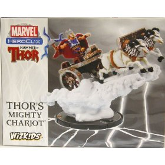

Hechos aparentemente confirmados:

* En la GenCon (y/o en la Comic-Con, según las fuentes) el stand de [NECA](http://www.necaonline.com/) (una empresa especializada en figuras de coleccionista, aunque también hace juegos de cartas, tablero y similares) ha mostrado una nueva **figura limitada de convención de HeroClix**, concretamente el Carro de Thor (Thor's Mighty Chariot).
* El stand aparecía acreditado en la feria como NECA/Wizkids.
* La figura [está a la venta en Amazon](http://www.amazon.com/Marvel-HeroClix-Hammer-Thor-EXCLUSIVE/dp/B002HWRQPG/ref=sr_1_1?ie=UTF8&s=toys-and-games&qid=1248308599&sr=8-1) (posiblemente sólo para USA).
* [Fotos de la nueva miniatura](http://heroclixworld.com/hcw/Articles.aspx?ID=115&F=HcR).
* En la página de Topps (supuestamente la anterior dueña de Wizkids) [hay un enlace en la que aparece](http://www.topps.com/wizkidsgames/HammerandThorChariot.htm). Esto confunde bastante.
* Esto coincide con los antiguos planes de Wizkids, que eran sacar la siguiente expansión, de nombre **Hammer of Thor**, que se canceló cuando sus actividades cesaron al decidir Topps que la línea Wizkids no les interesaba.

Rumore, rumore:

* Es posible que NECA haya llegado a algún tipo de acuerdo (bien comprando los derechos o vete a saber cómo) para **seguir utilizando la imagen de marca Wizkids**. Eso explicaría que la nueva figura se esté vendiendo con los logotipos de siempre.
* En hcrealms hay una [lista de figuras y sus diales](http://www.hcrealms.com/forum/showthread.php?t=256859) (sin fotos) de las miniaturas que compondrán la nueva expansión. Fiabilidad desconocida, al menos para mí.
* **La expansión aparecería a la venta en otoño**.
* No hay otros datos sobre otras licencias, por lo que no se sabe nada de DC HeroClix, HorrorClix, etc, etc. No creo que presuponer nada sea bueno.
