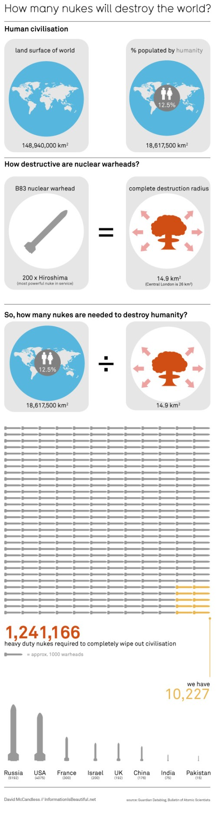

Teniendo en cuenta que la dominación del planeta comienza con una guerra termonuclear mundial (término que me encanta desde que vi por primera vez [Juegos de Guerra](http://www.imdb.com/title/tt0086567/)), parece que no es posible exterminar a un porcentaje significativo de la población mediante estos medios.

Imagen con licencia [Creative Commons Attribution Non Commercial](http://creativecommons.org/licenses/by-nc/3.0/)

David McCandless 2009, via [Information is beautiful](http://www.informationisbeautiful.net/2009/how-i-learnt-to-stop-worrying-and-love-the-bomb/).

Nos sigue quedando la guerra bacteriológica y la plaga de zombis.