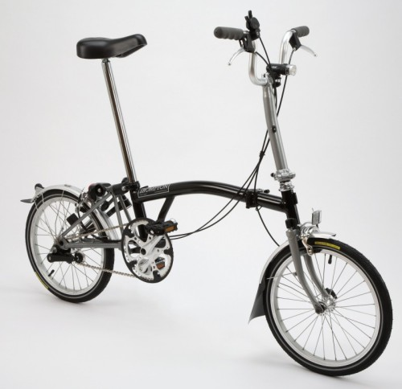

Este verano se empezaba a hacer necesaria alguna compra impulsiva para continuar en mi línea de consumista intrépido, y casi todas las papeletas apuntaban a un lector de eBooks (concretamente un iRex iLiad, que ahora tendrá que esperar), pero prácticamente en el último momento apareció la oportunidad de comprar una [Brompton](http://www.brompton.co.uk/) prácticamente sin uso y a muy buen precio.

Hace un tiempo ya estuve echando un vistazo a este tipo de bicicletas plegables, pero lo dejé de lado porque se subían mucho de precio si querías algo mínimamente decente... y finalmente no ha pasado de hoy. Ya he estado probándola por los alrededores de mi casa y creo que vale cada euro que he invertido.

Este modelo concreto es el de la bicicleta de tres marchas, pero con un único juego de plato-piñón, lo que ya es bastante distinto a los típicos juegos de marchas de bicicleta que he conocido de siempre... investigaré al respecto para entender cómo funciona (a priori parece que abriendo o cerrando más el sistema del cambio para que el "juego de poleas" por el que circula la cadena sea distinto. Cuántas cosas me quedan por conocer en el mundo...).

Foto del mismo modelo y en el mismo color (aunque la mía tiene ambas horquillas también en color negro y la luz es distinta)

Y un [vídeo del ingeniero que las diseñó](https://www.youtube.com/watch?v=pNnOdoUn3kg) demostrando cómo funcionan.