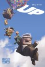
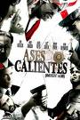
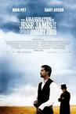
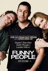
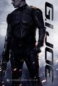
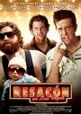

[Up](http://www.imdb.com/title/tt1049413/)

Preciosa, dramática, emotiva, bla, bla, bla... sí. Pero voy a desmarcarme de las opiniones de todo el planeta y afirmar que esto ya me lo contaron en sus anteriores películas. Como una enlatada producción pop para la radio-fórmula, parece que en Pixar ya saben cuándo colocar el chiste, cuándo el momento de aventura, cuándo la gracia para los niños y cuándo para los adultos. Una película perfecta pero que no me sorprende en nada no me parece mejor que una mala película con alguna cosa original. Llamadme amargado si queréis, pero me esperaba algo nuevo y salí de la sala con un cierto vacío.

[Ases calientes](http://www.imdb.com/title/tt0475394/)

Confusa producción bicéfala, con una aparentemente seria historia de unos agentes del FBI y una absurda conjunción de pseudo personajes destartalados (asesinos a sueldo, rednecks pasados de vueltas y hasta maestros del disfraz ). Si se hubiera quedado en su sobrecargada locura habría parecido una película de Guy Ritchie. Si se hubiera quedado en la historia seria podría haber sido mucho mejor. Buena la actuación de [Ryan Reynolds](http://www.imdb.com/name/nm0005351/). Al menos tiene un final original.

[El asesinato de Jesse James a manos del cobarde Robert Ford](http://www.imdb.com/title/tt0443680/)

Interesantes moralejas tras la historia de una relación de idolatría extrema. Habrá pasado muy desapercibida por la escasa afición a los western por parte de las nuevas generaciones de espectadores. Desgraciadamente no es un western, sino algo más cercano al thriller psicológico, con una innecesaria duración de más de dos horas que enlentece una película cuyo ritmo ya era lento de por sí. Gran puesta en escena, gran banda sonora, una hora menos de metraje le habría sentado de fábula.

[Hazme Reír (Funny People)](http://www.imdb.com/title/tt1201167/)

Un paso más hacia la conversión de Adam Sandler en actor dramático. Aún le queda. Es lo que necesita en su carrera, pero en este caso podría haberlo hecho con una cinta algo más clásica, sin un director de comedia. La mezcla, por cuestiones de guión, de los continuos chistes de un grupo de cómicos diversos, con los hechos teóricamente dramáticos, no acaba de encajar bien, chirría en ocasiones, aunque los continuos chistes de penes y culos tampoco ayudaron. Podría haber aprovechado los varios puntos de inflexión a lo largo del argumento para terminar la narración antes, en lugar de irse hasta unas completamente innecesarias dos horas y media. Recordad que es más seria de lo que parece, y que está catalogada para mayores de dieciocho... una familia sacó a sus escandalizadas hijas a los veinte minutos de metraje.

[G.I.Joe](http://www.imdb.com/title/tt1046173/)

Me encantó. El argumento y las situaciones vienen a ser las mismas que yo les hacía vivir a mis muñecos cuando tenía doce años, así que obviamente no le pidas más que eso. Aunque si le has pedido más que eso es que no sabías qué ibas a ver. Cumple con creces lo que se le espera, incluyendo el siempre soñado enfrentamiento cinematográfico entre los dos hermanos del clan Arashikage. Aunque la relación entre Duke y la Baronesa me pareció salirse demasiado del canon. Si, hasta de los muñecos hay canon.

[Resacón en Las Vegas](http://www.imdb.com/title/tt1119646/)

Media docena de analfabetos víctimas de la Logse se sentaron justo detrás de mí, por lo que no me enteré de la mitad de la película. Durante los chistes en la pantalla yo estaba absorto en mis cavilaciones sobre las posibilidades de que el resto del grupo saliera huyendo tras el desmembramiento del primero de ellos. Todo lo que recuerdo es que uno de los protagonistas me recuerda constantemente a Hugh Grant y que todas las féminas se enamoraron de [Bradley Cooper](http://www.imdb.com/name/nm0177896/). Mis acompañantes dicen que fue muy graciosa, así que tendré que creerles. Volveré a verla cuando la estrenen en el eMule.