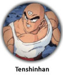

Acabo de terminar la colección de chapas de Bola de Dragón en Facebook... si no sabes de qué estoy hablando, mejor. Es una aplicación en la que coleccionas cosas virtuales inexistentes, de nula utilidad en el mundo real. Como coleccionar cromos, pero sin cromos, porque no hay nada físico que coleccionar. Llegando al final he aprendido cómo funciona la aplicación, así que os escribo este post para ayudar a que la terminéis en (mucho) menos tiempo.

**Esto es, además, una demostración de que puedo escribir una barbaridad de texto hasta sobre el tema más ridículo y absurdo.**

Cómo funciona:

*   **Entrando en la aplicación una vez cada seis horas obtenéis un crédito**. Con un crédito se puede comprar una _cápsula_ (chapa al azar) o se pueden guardar para comprar chapas sueltas en el _mercadillo_ interno.
*   **Enviando invitaciones a los demás se consiguen créditos**: se pueden enviar hasta veinte invitaciones diarias, que se transforman en cuatro créditos (uno cada cinco invitaciones). Si mandáis un número de invitaciones que no es divisible por cinco, el resto se guarda: si por ejemplo enviáis doce invitaciones, se os proporcionan dos créditos y el sistema recuerda las dos restantes para la próxima vez que enviéis algo. Se pueden enviar las invitaciones a veinte personas distintas, o esperar unas horas a que te permita repetir los envios a los mismos destinatarios (esto probablemente sea el funcionamiento genérico de facebook, no de la aplicación).

**Problemas**:

*   La aplicación tiene exceso de carga por tener demasiados usuarios. **Desde España no se puede utilizar más allá de las dos del mediodía**, probablemente por ser la hora a la que empiezan a funcionar los americanos: la aplicación tiene mucha más carga y se hace imposible de utilizar. Lo que vayáis a hacer lo hacéis por la mañana al comenzar a trabajar y ya podemos ignorar la aplicación.
*   La página de facebook que dice que la aplicación no responde sólo significa que no responde. Pero **nuestra petición puede haber llegado perfectamente**. Si el fallo se ha producido cuando intentábamos comprar una chapa en el mercadillo, después del fallo deberíamos ir a "Mis chapas" para ver si en realidad la compra ha sido efectiva. En ese caso, el problema ha sido que la aplicación, por exceso de carga, ha tardado en responder a facebook, que es quien nos da la respuesta final. Si tardan mucho, facebook se adelante diciendo que algo no funciona.
*   Si compramos una chapa y nos aparece de nuevo el mercadillo con un **"ERROR en la compra"**, sólo significa que otro se nos ha adelantado. Así es como funciona el mundo web con páginas estáticas: en el tiempo que pasa entre que tú ves que hay algo a la venta y haces click en comprar, otro puede haberlo hecho antes que tú, y ese es quien ha comprado.
*   Aunque los fallos anteriores puedan ser lógicos y entendibles, **en ocasiones la aplicación funciona mal**. Si intentas comprar la misma chapa a dos usuarios distintos, puedes haber obtenido sólo una pero haber hecho los dos gastos (así que no lo hagas). Este tipo de situaciones son las que pueden llegar a hacer que tengas un saldo de créditos negativo, y demuestran que la página tiene un control de la concurrencia nulo.

Y ya está, no hay más misterio. Ahora bien, **¿cómo conseguimos más chapas?**

1.  Nos olvidamos de lo de entrar cada seis horas. Proporciona sólo un crédito, por lo que no es rentable. Si cuando entremos nos da algo bien, si no, pasamos.
2.  Enviamos siempre a la misma gente. Por cansancio, al final acabarán entrando en la aplicación y haciendo la colección (o parte). Sí, soy un _spammer_ del averno, pero en la guerra todo vale.
3.  Cada vez que otros usuarios nos envíen algo, obtenemos la chapa al azar. Si es repetida la vendemos por un crédito y con eso conseguimos dinero. ¿Por qué? Porque en el mercadillo las chapas se ordenan según su valor, apareciendo primero las de coste uno, seguidas de las de coste dos, etc. Las de coste uno aparecerán siempre las primeras y serán las que se comprarán más rápido. De entre las de mismo coste, antes se ordenaban por número de chapa (orden alfabético), aunque ahora aparecen desordenadas, probablemente en un intento por reducir la carga de la aplicación.

¿Y esto es todo? Así no conseguiréis más de media docena de chapas diarias (del total de 378), lo que llevaría una eternidad. **¿Cómo maximizar el número de chapas que se puede conseguir cada día?** Ignorando el punto tres que acabo de escribir:

*   Si vamos al mercadillo, vemos que las chapas que ya tenemos aparecen sombreadas e inutilizables. _¡ERROR!_ **El enlace de _comprar_ sigue funcionando**, y podemos comprar de nuevo las chapas que ya tenemos.
*   Enviamos invitaciones y obtenemos cuatro créditos diarios. Tenemos que dividir los gastos entre chapas a un crédito que nos interesen y chapas a un crédito que ya tengamos pero que sean **interesantes para los fans**: siempre que veamos un Goku, Vegeta, Gohan, Piccolo, etc., los compramos igualmente, e inmeditamente los volvemos a poner a la venta a un precio mayor (dos créditos generalmente, tres si es un personaje muy protagonista, como Vegeta, que además únicamente tiene una chapa dedicada de toda la colección).
*   Las que nos envíen que ya tengamos y no sean interesantes, seguimos vendiéndolas a un único crédito, y así al menos tendremos una forma de entrada de efectivo más rápida (a un crédito siempre se venden más rápido).
*   Poco a poco, alguien las irá comprando en el mercadillo (quizá no sea instantáneo, tened paciencia: de una día para el siguiente estarán todas vendidas). **Cada gasto de un crédito se convertirá en el doble** o triple, del que seguiremos invirtiendo en la misma medida: mitad a nuevas incorporaciones para la colección, mitad a seguir multiplicando nuestro capital.
*   Si tenéis algo de tiempo libre (o un trabajo de oficina monótono y aburrido), podéis entrar cada hora y repetir el proceso, alcanzando un total de varias decenas de chapas diarias obtenidas, sin reducir nunca la cantidad de créditos que tenéis.
*   Cuando os acerquéis al final de la colección las chapas que no tenéis comenzarán a escasear, por lo que tendréis que buscar por todo el mercadillo y hacer alguna que otra compra cara... pero para eso habéis estado consiguiendo cada vez más créditos.

Conclusión: **viva la especulación**.

**¡Bonus! Truco que no se debería utilizar**: si la página de facebook te devuelve siempre error es, como hemos explicado, porque la dirección original donde está la aplicación tarda en responder... Pero siempre podemos hacer la petición directamente a esa aplicación original, y nuestro navegador web se quedará esperando el tiempo necesario:

**http://www.tapassots.com/fbdragonball/**