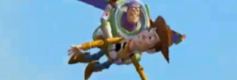

Para inaugurar la categoría, el  clímax final de la primera [Toy Story](http://en.wikipedia.org/wiki/Toy_Story): tras escapar de casa de Sid, Buzz (con un cohete pegado a la espalda) y Woody intentan llegar al camión de mudanzas. Sólo Woody lo consigue, y desde allí intenta rescatar a Buzz utilizando a R/C, el coche de radio control. Sus antiguos amigos, que no confían en él, lo tiran del camión, pero Buzz, que sigue la persecución montado en R/C, lo recoje por el camino... hasta que se acaba la batería.

A Woody se le ocurre encender el cohete, y gracias a eso despegan... y vuelan. Planeando hacia tierra dejan a R/C de nuevo en el camión, pero ellos siguen hasta su verdadero lugar, el coche familiar con Andy. La escena es espectacular \[[youtube, baja calidad](http://www.youtube.com/watch?v=UZXOTmLCwws)\], con una secuencia de distintos problemas y sus soluciones que no se puede  adjetivar con otra palabra que no sea impecable.

> - Buzz, ¡estás volando!
> - Esto no es volar, es... caer con estilo.
> - Ja, ja. Hasta el infinito, ¡Y más allá!

Este es el momento que realmente define la relación entre los dos protagonistas, que es de lo que habla esa gran alegoría de la amistad que es Toy Story. Toda la película se desarrolla alrededor de los conceptos de amistad y de encontrar tu lugar en el mundo, y es en esta escena cuando los dos se dan cuenta por fin de la amistad que los unirá y de cuál es su verdadero sitio.

Y es un peliculón como la copa de un pino, y la mejor película de Pixar, con diferencia.
