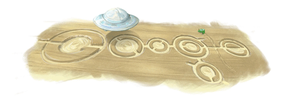
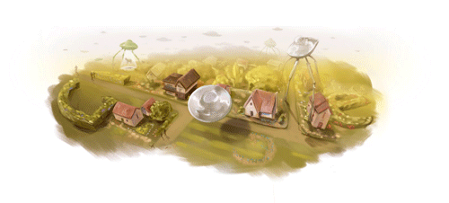

Ya hablamos de [uno de estos logos](https://neverbot.com/ilustracion/fenomenos-inexplicables-en-el-logotipo-de-google/) no hace mucho por aquí, y hoy encuentro otros dos de temas similares, teniendo el último de ellos una historia interesante detrás sobre su no-publicación en España, que puede leerse en [magonia.](http://blogs.elcorreodigital.com/magonia/2009/9/21/google-celebra-natalicio-h-g-wells-con-platillos-volantes)

