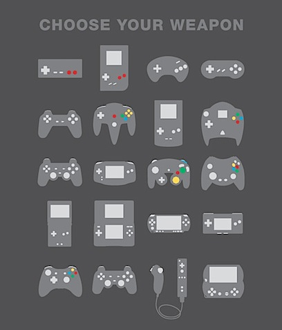

Vía [Livertumblr](http://livercake.tumblr.com/post/208711006/arriba-a-abajo-izquierda-a-derecha-nes-gameboy). Once de estas armas de destrucción masiva las tengo en propiedad. Eso significa que me faltan nueve, y eso es una vergüenza. Claro que el hecho de que haya cinco versiones de Game Boy en este dibujo es absurdo. Siguiendo ese patrón deberíamos poner tres de DS, dos mandos de la XBox original, etc., etc., más las consolas que faltan, que son muchas. Cuatro de esas versiones de Game Boy, las dos PSP y la PS3 son las posesiones obvias que no creo que llegue a tener nunca. NES y N64 son las faltas que debo solucionar algún día. Siempre fui de Sega, qué le vamos a hacer.
