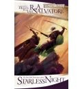
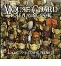
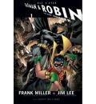
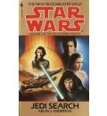

Teniendo en cuenta que el mundo editorial en España es caótico, impredecible y, mayoritariamente, incomprensible, voy a comenzar una nueva sección (quizá periódica, quizá aperiódica, o quizá se quede en únicamente un primer post): **¿En qué gastar cincuenta euros que pueda ser interesante (o no)?**

Pues para empezar vamos a poner como ejemplo mi última compra a [BookDepository.co.uk](http://www.bookdepository.co.uk/), una tienda de libros (estilo _amazon_) con dos peculiaridades muy interesantes:

1. **Tiene precios aceptables.**
2. **Tiene gastos de envío gratuitos a todo el planeta**, por lo que los precios al final son aún más interesantes.

Mi compra de este mes:

[Starless Night](http://www.bookdepository.co.uk/book/9780786948611/) (Noche sin estrellas). En castellano creo recordar que está descatalogado, y ya sólo se puede comprar en cofres o en la horrenda edición de "_coleccionista_" que tiene _Timun Mas_. El precio individual rondaba los catorce euros. Precio en _BookDepository_: 4.91 euros.

Es el... ¿octavo? libro de _R. A. Salvatore_ centrado en el personaje de _Drizzt Do'Urden_. En mi post sobre el último de estos libros que leí ([El Legado](/el-legado-de-rasalvatore/), que era el séptimo, post de Julio de 2008), lo puse a caer de un burro, y con razón. Quiero probar el siguiente en inglés por ver si cambia algo. No aprendo y no aprenderé nunca.

 [Mouse Guard, The Roleplaying Game](http://www.bookdepository.co.uk/book/9781848561748/). Uno de los juegos de rol independientes que más ruido han hecho durante el último año (mejor juego del 2009 en los premios _Origin_).

Posibilidades de que algo así se publique en España: cero. Si no publican ni [The Burning Wheel](http://en.wikipedia.org/wiki/The_Burning_Wheel), que es el reglamento en el que se basa este juego (que es una versión algo simplificada del mismo, si no lo he entendido mal), entonces esto no llegará jamás. Y casi mejor, porque aquí todos los juegos que se publican rondan los cuarenta euros. Precio en _BookDepository_ (en oferta, además): 16'56 euros. Por una edición en tapa dura de 320 páginas. No está mal.

[All Star Batman & Robin](http://www.bookdepository.co.uk/book/9781845764562/), tomo uno en _trade paperback_ (es decir, tapa blanda). Aquí se ha editado en una edición _absolute_ de tapa dura a 20 euros. Precio _BookDepository_ de edición popular, la única que deberían tener este tipo de productos: 9'88€.

Es de _Frank Miller_ y de _Jim Lee_, lo cual no me garantiza absolutamente nada aparte de que el abanico de posible calidad puede ir desde la mayor estupidez hecha tebeo hasta algo legible y visualmente noventero. Por menos de diez euros puedo arriesgarme, por veinte, no.

[The Umbrella Academy: Dallas](http://www.bookdepository.co.uk/book/9781595823458/) (el tomo dos de la colección). Con el primero disfruté como un enano, me pareció un tebeo bastante interesante y visualmente llamativo. Tiene la suficiente fuerza como para querer saber más de este nuevo universo (ignorad el hecho de que el guionista es el cantante de _My Chemical Romance_, porque al final parece que hasta va a tener imaginación y todo).

Precio en _BookDepository_: 10'63€. Precio aquí... ¿quién sabe? El primer volumen, en lugar de editarlo en un único tomo, fue partido en tres mini volúmenes de cinco euros y medio cada uno, haciendo un total de 16'50 con una edición más fea. El segundo volumen será editado dependiendo de la conjunción de marte y venus el día que el editor deba tomar la correspondiente decisión.

[Jedi Search](http://www.bookdepository.co.uk/book/9780553297980/), de _Kevin J. Anderson_. Sigo con mi lectura de las novelas posteriores a _Episodio VI: El Retorno del Jedi_ (porque todo lo relacionado con los episodios uno a tres me produce una urticaria tremenda... y además ya me sé el final). Esto se publicó aquí hace muchos, muchos años, cuando **Martinez Roca** tenía los derechos. Ahora con **Alberto Santos** no se ha publicado prácticamente nada posterior a _Episodio VI_, exceptuando tres o cuatro libros de la _Nueva Orden Jedi_... y estamos hablando de un salto argumental de unos veinticinco años, y medio centenar de libros entre medias. Unos más importantes, otros menos. Yo sigo intentando leerme los más importantes de esos veinticinco años argumentales que nadie parece tener intención de editar en castellano, y está claro que tiene que ser en inglés.

Aquí las novelas de _Star Wars_ son caras. _Vector Prime_, la primera de la _Nueva Orden Jedi_, cuesta unos veinte euros en la _fnac_, que ya tiene descuento incorporado. _Jedi Search_ me cuesta en _BookDepository_ 4'35€.

En fin, estas son las diferencias entre el mundo editorial en España y en el extranjero. Si pido algo al Reino Unido me lo ponen gratis en la puerta de mi casa por la mitad del gasto. Si quiero comprarlo en España tengo que irme a una tienda especializada al centro de la ciudad, meterme en un atasco, pagar el doble, y encima aguantarme (generalmente) con una edición irrespetuosa con el comprador.

Y sí, soy plenamente consciente de que lo que recomiendo este mes es horrible e ilegible en tres de los cinco casos. Pero os podéis quedar con **Mouse Guard** (o los tebeos en los que está basado el juego) y **Umbrella Academy** como mis recomendaciones del mes. Y el resto como comentarios de ejemplo para que veáis cómo está el patio.
