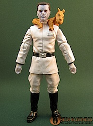

Ayer salí de una juguetería (de LA juguetería, _Toys'r'us_) sin llevarme una figura del [Gran Almirante Thrawn](http://starwars.wikia.com/wiki/Mitth%27raw%27nuruodo). Es la segunda vez que paso por ese lugar de perdición, deseo profundamente llevarme un objeto tremendamente _geek_ relacionado con _Star Wars_... y no lo hago.

Es un personaje genial, de las novelas del universo expandido de _Star Wars_, y hubiese sido el toque perfecto de _geekismo_ para mi escritorio. Al llegar a casa di un vistazo a _eBay_ que me enseñó que hay otras (aunque pocas) de este personaje, como [esta de doce pulgadas](http://plasticandplush.com/2009/08/grand-admiral-thrawn-16-scale.html) (tamaño _Action Man_). Y lo peor de todo es que no la compré porque era un _pack_ de dos figuras por veinte euros, y la segunda (_Talon Karde_) no me interesaba. Buscando otros precios no está en ningún sitio por menos de veinticinco. Creo que tendré que hacer una segunda visita a ese antro de perdición y lujuria.

Para suplir la falta mientras tanto, me he apuntado al grupo de FaceBook [Grand Admiral Thrawn was greater than the Emperor](http://www.facebook.com/group.php?gid=2208219646). El que no se consuela es porque no quiere.