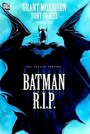

Ya prácticamente no compro tebeos americanos _mainstream_ en castellano, exceptuando alguna compra muy puntual por seguir a algún autor, pero hace un par de días pasé por una librería y decidí arriesgarme con una novedad, por tener algo que leer esa tarde. Opté por el último tomo de Batman publicado por Planeta: **Batman R.I.P.**

He pagado 17 euros por un timo, y es que **la editorial engaña por partida doble**:

1. Interrumpe la colección regular de Batman, donde deberían encajar los números unitarios que componen este tomo, para publicar esto en un tomo... lo que **parece indicar al comprador que es un conjunto argumental autónomo**, que puede leerse únicamente con lo que en él está contenido.
2. **Le proporciona una tapa dura** y una serie de características, además de un precio que no es barato, queriendo hacer ver al comprador que es algo que realmente merece esta edición, que puede ser una historia realmente buena y que el tebeo se la merece.

**Los dos puntos anteriores son mentira**. El último número de la colección regular en grapa aparece con el subtítulo _Batman RIP: Prólogo_. Lo que también es mentira, porque no existe ningún prólogo, son simplemente dos historias más, exactamente igual que el número anterior. La decisión de dónde poner el comienzo de la historia y dónde colocar el supuesto prólogo ha sido completamente arbitraria. De hecho ya la primera página del tomo incluye un amplio resumen en texto para entender de dónde está viniendo toda la historia, ya que, siendo honestos, te encuentras en la mitad de una saga amplia y no hay ningún tipo de comienzo argumental ni en el prólogo ni en el tomo.

**Y el final... es inexistente.** Es simplemente el final del número americano que el editor español ha decidido incluir como último en este horrendo libro. No es ni un continuará ni un final con un _cliffhanger_... en el sentido que no es mayor ni más importante que los que hay entre los demás números americanos que componen el tomo. Nuevamente, el editor podría haber decidido terminar el libro quizá un número antes, quizá un número después, quizá siete números después, viendo que no existe unidad argumental alguna.

**Una excusa fácil podría ser: son los mismos números que el tomo americano original. No existe ningún tomo original. En todo caso un _trade paperback_, pero los _TPBs_ no implican ningún tipo de unidad argumental ni de ser una historia mejor o peor que las demás... son simplemente una segunda edición en tomo que se hace de TODA la colección poco tiempo después de la primera edición en grapa. Se van agrupando de x números en x números y punto. Querer editar eso aquí, con el concepto de tomo que tenemos aquí, es una engañifa.**

**¿Eso de quién es culpa?** De un editor listo (que no inteligente) que quiere aprovechar el tirón de una supuesta muerte de Batman (¡ja!) para vender más ejemplares (haciendo que el tebeo llame más la atención en la estantería por venir en tomo "_fuera de la colección_") y además sacar más beneficio (por cobrarlo más caro con una tapa dura innecesaria).

Y es que **¿es necesaria esta edición de lujo para esta historia?** No. La historia es una estupidez como la copa de un pino, Morrison no sabe, ni ha sabido nunca, cómo hacer que una historia merezca la pena si no tiene un artista que le haga el trabajo sucio (lo que empieza a dejarme muy claro de quién ha sido el mérito de las ventas de Morrison) y Tony Daniel es un completo y absoluto inepto a los lápices. Alguien que no dibuja fondos, cuyos rostros son todos iguales unos a otros, que no sabe hacer la perspectiva más simple, que no sabe dibujar cualquier cosa normal como pueda ser un coche o un árbol y que, lo peor de todo, es un narrador gráfico pésimo.

La historia está repleta de supuestos _flashbacks_, visiones, sueños y demás parafernalia _Morrisoniana_, y **Tony Daniel sólo es capaz de confundirnos** página tras página para que no entendamos nada de lo que estamos leyendo. En las últimas páginas del tomo aparecen algunos bocetos de Morrison (a modo de "_Cómo se hizo_") para indicarle al dibujante que el patrón de las viñetas en unas páginas debe seguir una determinada forma. Por supuesto, si no lo hubiese leído no lo habría visto jamás, porque Daniel no es capaz de conseguir ni eso. Nunca fue un gran artista, pero desde luego ha ido en regresión desde sus tiempos en _Spawn_. Y unos personajes de colorines con trajes estúpidos que nos hacen volver casi a los años setenta no ayudan a tomarse en serio lo que nos están contando.

**Resumamos**: 17 euros por una historia que no tiene ni principio ni final. Por una historia que es una completa absurdez argumental. Por una historia que está mal dibujada y mal narrada. Y en tapa dura.

La escasa calidad de esta historia y sus características narrativas no dejan otra opción que haber seguido publicándola en su colección mensual en grapa. El editor español ha decidido _tangar_ a los compradores tomando decisiones absurdas y mayoritariamente estúpidas. **Y con esto ha perdido un comprador.**
