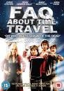
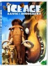
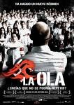
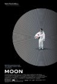
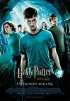
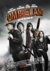

Hemos terminado varias temporadas de series y nos hemos puesto con películas, qué le vamos a hacer.

**[Frequently asked questions about time travel](http://www.imdb.com/title/tt0910554/)** (2009)

Película de la BBC de la que me permito dudar que vaya a ser doblada jamás al castellano. La conocí gracias al [miniblog Dosis mínima](http://dosisminima.wordpress.com/2009/10/30/frequently-asked-questions-about-time-travel/) de John Tones, y no ha defraudado. Tres amigos comienzan a hablar en un bar sobre varias tonterías, entre ellas los viajes en el tiempo (¿Quién no lo ha hecho?) para descubrir que en los servicios del pub hay una disfunción temporal que comienza a hacerles cambiar de época. Muy bien llevada y aparentemente coherente en su dificultad (teniendo en ocasiones hasta a tres versiones temporales de los mismos personajes en el mismo lugar, aunque tampoco me he puesto a analizarla concienzudamente), es muy recomendable para todo amante de la ciencia ficción de libro. Desgraciadamente se ve empañada por alguna situación risible en sus últimos minutos, tratando de buscar un innecesario "enfrentamiento final" con un "enemigo" que hasta ese momento no existía y que es innecesario. Ojalá se hicieran más como esta.

**[Ice Age 3](http://www.imdb.com/title/tt1080016/)** (_Ice Age: Dawn of the Dinosaurs_, 2009)

Argumento resumido de las tres Ice Age: grupo de animales graciosos corre en una dirección haciendo chascarrillos más bien malos, fin. Intercalados a intervalos periódicos se incluyen _sketches_ de una ardilla sin ninguna relación argumental con el resto de la película, para conseguir llegar al metraje mínimo para que se considere _largo_. La primera vez fue original, la segunda ya olía un poco y la tercera pues te hace soltar alguna sonrisa mientras te preguntas si era necesario verla. Tampoco es que sea muy mala _per se_, simplemente es que es otra vez lo mismo y, lógicamente, va empeorando un poco.

**[La ola](http://www.imdb.com/title/tt1063669/)** (_Die Welle_, 2008)

Un profesor trata de enseñar a unos alumnos de instituto algunos detalles sobre la autocracia y el pensamiento del grupo por encima de la individualidad. Cuando ve que determinadas formas de enseñanza comienzan a dar el resultado deseado, lleva el experimento más allá, y los alumnos se autoorganizan en un grupo de tintes filonazis.

Fábula con moraleja que trata de enseñarnos lo fácil que es (volver a) caer en determinados comportamientos y lo bien que viven algunos cuando no necesitan pensar demasiado. Perfectamente creíble aunque quizá no en el lapso de una semana que nos muestra la película, siempre acompañada de un "basado en hechos reales" que habría que estudiar para saber hasta qué punto.

Por lo demás impecable y recomendable. Y es alemana, dos películas europeas en una semana.

**[Moon](http://www.imdb.com/title/tt1182345/)** (2009)

Dos películas de ciencia ficción en el mismo post. La primera me llamó la atención por original y esta, además, por parecerme muy buena película. Grandioso Sam Rockwell que se enfrenta en solitario a la cámara durante todo el metraje, dando además distintos registros de un modo que tampoco os puedo contar sin romper el argumento. Si en lugar de ser un astronauta en la luna fuera un _lord_ victoriano este año se llevaría alguna nominación. En Sitges ganaron mejor película, guión, actor y diseño de producción.

Es el debut de su director y guionista, Duncan Jones (¡hijo de David Bowie!), que ya está trabajando en una nueva película, también de ciencia ficción. Genial, porque necesitamos más como este. Ha sido un buen año para la ci-fi.

[**Harry Potter y la Orden del Fénix**](http://www.imdb.com/title/tt0373889/) (_Harry Potter and the Order of the Phoenix_, 2007)

En fin. En franca decadencia y cuesta abajo y sin frenos. A cada película que pasa la producción y la dirección son peores. Con decir que esta ya no tiene ni los créditos finales animados creo que lo estoy diciendo todo. Hay errores de _raccord_ de objetos que cambian de manos y de personajes, escenas que no se comprenden y, en general, aburrimiento. Tratan de resolver la película con un grandioso combate entre magos que no tiene emoción ninguna (con una música muy poco apropiada, por cierto) y escenas que, aunque lo intentes, es imposible que no te recuerden a enfrentamientos entre _jedis_ y _sith_. Pero en cutre. En más cutre, quiero decir.

Los actores protagonistas cada año que pasa lo hacen peor, y a _Hermione_ no la van a contratar en la vida para nada más. Lástima de _casting_ original. Y los secundarios, supuestos actores de renombre, a cada película están más histriónicos e irreconocibles (no en caracterización, sino en calidad interpretativa, quiero decir).

Y aún me queda una por ver. Madre mía que desgracia.

**[Zombieland](http://www.imdb.com/title/tt1156398/)** (2009)

En palabras de mi acompañante durante unos minutos: "_esto es horrible, es tan malo que me está incluso poniendo de mal humor"_. Así que dejé la película para verla más adelante. En palabras mías, tras verla sin interrupciones externas: genial, magistral y divertidísima. Grandiosos los personajes y las situaciones, enorme Woody Harrelson y desternillante Bill Murray interpretándose a sí mismo.

Por favor, quiero un _Return to Zombieland_.
