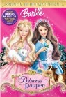
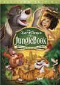
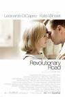
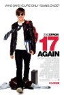

Ecléctico que es uno...

**[Nunca es tarde para enamorarse](http://www.imdb.com/title/tt1046947/)** (_Last chance Harvey_, 2008)

Dustin Hoffman y Emma Thompson (mayores, pero uno bastante más que la otra), se conocen de casualidad tras una larga vida de soltería y malas experiencias en el caso de ella y un amargo divorcio, fracaso profesional y desencanto familiar en el caso de él. Nos vuelven a vender el mensaje de que es imposible vivir bien si uno no está en pareja, y que el resto de objetivos vitales que puedas tener no son nada.

Aparte de eso es una película predecible pero aceptable para quienes nos gusten este tipo de dramas sensibleros. Tarde de domingo al cien por cien.

**[Barbie en la princesa y la costurera](http://www.imdb.com/title/tt0426955/)** (_Barbie as the Princess and the Pauper_, 2004)

No preguntéis, la estaban viendo las sobrinas de mi novia y me sentí atrapado por un hechizo maligno que me impidió dejar de verla.

Una película en 3D para sacarles los cuartos a los padres con la excusa de mantener a los hijos contentos, donde las 3D son de primer curso de academia (juraría haber visto incluso algunos pliegues erróneos de las mallas en alguna ocasión), sin cosas tan curiosas como pelo, telas, líquidos ni nada que se le parezca. Técnicamente tiene bastante menos calidad que un anuncio de Actimel. Y el argumento... pues podemos empezar porque Barbie no sale. Hay una princesa y una costurera a quienes les suceden cosas sin sentido, pero no hay ninguna Barbie en toda la película, lo que nos deja muy claro el concepto de "_tirar de la franquicia sin rubor ninguno_". La historia en general no tiene ningún sentido, e incluso hay un personaje que es un gato y ladra. Y no me lo estoy inventando.

Moralejas que pueda extraer cualquier espectador: el final último de la vida es el matrimonio, y sin él nada más tiene sentido (todos los personajes se casan al final, incluidos los animales); la monarquía puede optar a una vida de cachondeo, dejando de lado sus obligaciones pero no sus derechos, dónde vamos a parar; y da igual cuál sea tu ocupación en la vida, princesa o costurera, todo será perfecto siempre que tengas vestidos bonitos y puedas casarte.

Estamos destruyendo el futuro de nuestra civilización. Lo curioso es que son películas muy, muy baratas de producir pero, por lo que me dicen, venden como churros.

**[El libro de la selva](http://www.imdb.com/title/tt0061852/)** (_The Jungle Book_, 1937)

Genial, nunca pasa el tiempo por ella. Poco más que añadir, excepto dos conclusiones que cruzaron mi mente como estrellas fugaces: Una, que las canciones de Baloo han debido hacer mucho daño al capitalismo norteamericano durante los últimos 70 años (_Nunca del trabajo hay que abusar_), y dos, que en cuanto hay mujeres de por medio, todos dejamos de lado a nuestros amigos (teniendo en cuenta que ese es el final de la película).

**[Revolutionary road](http://www.imdb.com/title/tt0959337/)** (2008)

Leonardo DiCaprio y Kate Winslet vuelven a juntarse después de Titanic para... no tengo muy claro para qué, porque el papel de él no pega para nada con el actor. Un drama (muy drama) sobre una familia que se construyó sobre la falsa idea de que debía ser una familia. Como todas, supongo, sólo que en este caso el paso de los años va dejando un poso de reproches y autonegaciones que acaba por ser mayor que los momentos felices compartidos. Una historia de la autodestrucción de una pareja de la que, lógicamente, no os estropeo nada si os digo que no acaba del todo bien. No os recomiendo verla si estáis pasando por una crisis de pareja.

**[17 otra vez](http://www.imdb.com/title/tt0959337/)** (_17 again_, 2009)

Y yo que pensaba que era una comedia en la que Matthew Perry volvía a tener 17 años (_Big_ a la inversa). Eso me llamaba la atención, pero el problema es que la película completa es sobre esos momentos con 17 años interpretados por Zac Efron, en una película cuyo objetivo único es su promoción como producto de _marketing_. El chico es mono, pero se pasan un poco con el asunto de la publicidad del actor como producto.

Tremendamente prescindible. Y si sois mínimamente _frikis_ el _sidekick_ del protagonista os parecerá un continuo insulto.

No ha sido una gran semana, cinematográficamente hablando, la verdad. Menos mal que estoy viendo el final de _Galactica_ para compensar.