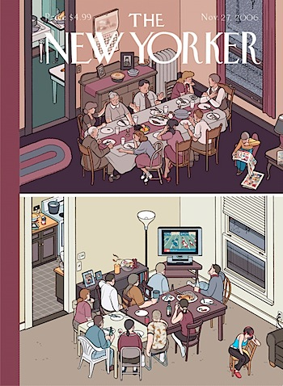

He cambiado la colocación de la publicidad en la portada del blog (a ver si subo de cero _clicks_ en la publicidad a uno o dos), y he añadido mi última actualización de Twitter justo encima, con algo que parecía una modificación sencilla y al final me ha llevado media tarde \[he escrito [un post en neverbyte.net](http://www.neverbyte.net/archivo/anadir-tu-estado-de-twitter-en-wordpress/) por si le puede ser de utilidad a alguien\].

Pequeños cambios, echadle un vistazo y me comentáis qué os parece. O no.

Ah, la vida moderna. [Ilustración de Chris Ware](http://www.acmenoveltyarchive.org/item.php?item_no=556) para The New Yorker, vía [Livertumblr](http://livercake.tumblr.com/day/2009/11/27).