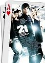
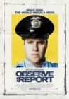
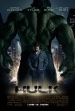

**[Punisher 2: War Zone](http://www.imdb.com/title/tt0450314/)** (_Punisher: War Zone_, 2008)

En España se optó por no estrenarla en cines y distribuirla directamente en DVD. Ahí están reflejadas todas mis posibles opiniones al respecto. Casquería sin ningún tipo de interpretación, con el protagonista más sosez que pueda existir. Y las sobreactuaciones de los villanos son para dar de comer aparte. Es una pérdida de tiempo. _Punisher_ tirotea a todo lo que se mueva sin ningún criterio argumental aparente, y fin.

**[21 Black Jack](http://www.imdb.com/title/tt0478087/)** (_21_, 2008)

Bueno, pues psé. Unos cerebritos del MIT tratan de enriquecerse contando cartas en las mesas de Black Jack de Las Vegas, coordinados por un _Kevin Spacey_ que ya siempre parece un _Kaiser Soze_ de segunda fila (ups, ¡vaya _spoiler_!). Para intentar contrarrestar el protagonismo, un _Lawrence Fishburne_ que tampoco está en sus mejores días. Entretenida, dentro de lo que cabe, pero tampoco esperéis gran cosa.

**[Nick y Norah, una noche de música y amor](http://www.imdb.com/title/tt0981227/)** (_Nick & Norah's infinite playlist,_ 2008)

El descubrimiento de la semana. Dos chavales en su último año de instituto, etc, etc, la típica historia de los ritos de paso a la madurez, condensada en una única noche de los protagonistas. Ya [decía hace poco](https://neverbot.com/cine/resenas-cinematograficas-relampago-iv/) que _Michael Cera_ será un grandísimo actor dramático algún día, y me reafirmo. Por lo demás, toda la película es un largo videoclip con una constante banda sonora de fondo, con una gran lista de grupos independientes que tengo que conseguir y empezar a escuchar. La mejor película de la semana.

**[Cuerpos de seguridad](http://www.imdb.com/title/tt1197628/)** (_Observe and Report_, 2009)

Lenta, coñazo y aburrida. Todas las razones por las que [no podía soportar](https://neverbot.com/cine/resenas-cinematograficas-relampago-iii/) ver Pagafantas, sólo que a esta he de añadirle que no me hace gracia en ningún momento. Bajamos a _Seth Rogen_ un escalón de mi pedestal particular. Me pregunto qué hace _Ray Liotta_ en una película como esta. No recomendable bajo ningún prisma, a no ser que te regodees con el drama de un vigilante de seguridad con trastorno bipolar y madre alcohólica y que el guionista pretenda convertirlo en comedia. Yo no puedo.

**[Paso de ti](http://www.imdb.com/title/tt0800039/)** (_Forgetting Sarah Marshall_, 2008)

Dejando a un lado la traducción del título... aceptable. Protagonizada y (¡atención!) escrita por _Jason Segel_ (el _Marshall_ de _Cómo conocí a vuestra madre_) y producida por _Judd Apatow_ (otra vez, este hombre está en todas las comedias americanas de la última década).

La verdad es que no es nada del otro mundo, pero dentro de lo que cabe es bastante sólida, tiene un desarrollo ciertamente decente e incluso alguna que otra mezcla entre momentos de drama y comedia que me permiten recomendarla sin sonrojarme demasiado.

Argumento (como si hiciera falta para este tipo de películas): _Jason Segel_ es abandonado por su novia, y tras un tiempo de lloros decide pasar unas vacaciones en Hawai para olvidar su pasado... para encontrarse con su exnovia y la nueva pareja de esta en el mismo _resort_. Casualidades de la vida.

Y como descubrimiento de la película, [la actriz _Mila Kunis_](http://images.google.es/images?q=mila+kunis), con quien intentaré cabrear a mi novia cada vez que me recuerde lo tremendamente perfecto que es _Hugh Jackman_.

**[El Increíble Hulk](http://www.imdb.com/title/tt0800080/)** (_The Incredible Hulk_, 2008) **revisionado**

Aunque ya la vi en cine, he aprovechado para un segundo visionado de la segunda película de _Hulk_ (la de _Edward Norton_, no la de _Eric Bana_). Pues oye, que quieres que te diga, para ser lo que es no está mal. Desde luego es mejor que la anterior desgracia de _Ang Lee_, pero tampoco hay tantas diferencias entre una y otra, la verdad.

Decía _Alan Moore_ que no hay malos personajes, sino malos guionistas, pero en el cine aún estoy por comprobarlo. El día que alguien coja a personajes indestructibles y sea capaz de crear una narración coherente y entretenida en torno a eso, podré opinar (aún quiero ver una buena película de _Superman_). Si además de ser indestructible (es decir, no puedes tener un contrapeso narrativo que sea realista y medible por los estándares humanos) cogemos un personaje que no es capaz de hablar, obtenemos como resultado la incapacidad de la mayor parte de los guionistas de Hollywood para contar algo interesante. Hay miles de tebeos decentes, pero en pantalla aún no lo veo claro.

Mi apuesta es que antes de la película de los Vengadores, o en esa misma, _Hulk_ va a dar el paso a un ser inteligente incapaz de "_destransformarse_" como fue durante mucho tiempo en el tebeo.

Y siempre me preguntaré que vio _Edward Norton_ en esta historia (aparte de un cheque enorme, claro) para formar parte de ella. El _Hulk_ de _Eric Bana_ al menos se parecía al actor, pero en este caso... ni eso. No tiene escenas interesantes como el _Doctor Banner_, el monstruo no se parece a él, su foto en el cartel apenas se ve... no le veo sentido.