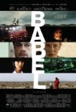
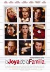
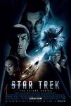

[Vicky Cristina Barcelona](http://www.imdb.com/title/tt0497465/) (2008)

Había tardado en acercarme a esta película, y no es porque sea de _Woody Allen_ (no sé qué tiene la gente contra sus películas, siempre me han parecido muy trabajadas y muy potables todas ellas, yo no sé qué esperan al ir al cine, la verdad)... sino porque como en España somos los más _chauvinistas_, parecía que fuera obligatorio verla sólo porque actuaban dos españoles.

Curiosidades: Uno, _Penélope Cruz_ no es ni _Vicky_ ni _Cristina_, y sin embargo sale en el cartel cuando tiene un papel tremendamente secundario, lo que me parece un insulto para la otra actriz protagonista. Dos, en la versión traducida poco se puede apreciar de las actuaciones de nadie, porque perdemos los cambios de inglés a español que tienen los actores, así que no puedo opinar demasiado. Algún día, cuando no me queden películas por ver y no haya ovejas (chiste malo), quizá la vea en versión original.

Por lo demás la película está bastante bien. Las típicas relaciones excesivamente tranquilas y las excesivamente tormentosas, y un pedacito de la vida de los protagonistas con un final que sólo puede enseñarnos que cada uno es como es.

[Mi nombre es Harvey Milk](http://www.imdb.com/title/tt1013753/) (_Milk_, 2008)

_Gus Van Sant_ y _Sean Penn_, obviamente iba a ser una buena obra. Muy bueno el trabajo de escritura para convertir lo que podía haber sido un aburrido _biopic_ en un arco narrativo claro, con presentación, nudo y desenlace y que mantiene el interés por ver cómo terminará la historia, incluso contando con sus dos horas de metraje.

Muy bueno _Sean Penn_ (también me gustaría verla en versión original, por saber si la voz original del actor también muestra la pluma que tiene traducido), en su línea de uno de los mejores actores vivos. Interesante _James Franco_, que aunque tiene pocas líneas muestra muchas cosas sólo con gestos y miradas, habrá que seguirle con atención.

¿Qué más contar? Si queréis saber de qué va, buscad la historia del personaje real en la Wikipedia, que esto no es un servicio de información al ciudadano.

[Babel](http://www.imdb.com/title/tt0449467/) (2006) **revisionado parcial**

¿Revisionado parcial? ¿Eso qué es? La primera vez que la vi no pude terminarla. Era una versión descargada de internet sin subtítulos y, la verdad, así te pierdes demasiadas cosas en una película que aparentemente habla sobre la capacidad para comunicarse de distintas culturas y distintos mundos.

Ahora la daban por "el plus" y pude verla entera de nuevo. Impresiones principales: que aunque la película está bastante bien cae en muchos tópicos. Se regodea en su carácter de obra artística y nos aburre con largas tomas de paisajes que no añaden nada a la historia, haciéndose además demasiado larga.

De todos modos el principal problema que le veo puede ser más personal, una cuestión de mera percepción. Yo no veo tantos problemas de entendimiento como problemas de exclusión social y económica, a lo que no ayuda que la mayor parte de las historias que se cuentan y se entrelazan en mayor o menor medida acaben bien. Si alguna historia hubiese acabado rematadamente mal habría ayudado a crear sensaciones distintas en el espectador.

¿Soy el único que ve un alegato contra las armas en esta historia?

[La joya de la familia](http://www.imdb.com/title/tt0356680/) (_The Family Stone_, 2005)

Una de esas películas en tierra de nadie, ni comedias ni dramas, que tan de moda se han puesto últimamente. Todos los actores en el único papel que saben hacer, _Sarah Jessica Parker_ en el de estirada con un palo metido por el culo, _Dermot Mulroney_ en el de pijo perfecto, _Diane Keaton_ en el papel de _Diane Keaton_, y _Luke Wilson_ en el papel de _Luke Wilson_. Todo bastante previsible. Incluso incluye algunos minutos, hacia el final, de comedia tonta con los protagonistas persiguiéndose por la casa, al más puro estilo _Sólo en casa_ o cualquier película de _Chevy Chase_.

Un final irreal en el que se rompen relaciones y se crean otras nuevas de la noche a la mañana sin el más mínimo descalabro emocional. Tarde de domingo.

[Star Trek](http://www.imdb.com/title/tt0796366/) (2009) **revisionado**

_Star Trek_, _Star Trek 2009_, _Star Trek XI_, en fin. ¿Sentimientos encontrados? Claro. _Star Trek_ no es... no era... _esto_. Era la última frontera, la exploración de nuevos mundos y entrar en contacto con civilizaciones donde ningún hombre ha llegado antes.  

Esto es _Star Wars, Episodio VII: me llamo J.J. Abrams y sé hacer pelis mejores que tú, George Lucas de tres al cuarto_. Es una descontextualización total de la idea original, en todos los aspectos. Argumentalmente, hacemos un _retcon_ en toda regla para explicar un origen nuevo de todos los personajes, olvidando todas las series y películas existentes (que ya eran, ejem, diez). Narrativamente, como digo, esto es una película de acción, que es una idea muy lejana al espíritu de _Star Trek_.

Ahora bien... la película mola. Y punto. Eso es innegociable. Se ha pulsado el botón de _resetear_ el sistema y tenemos una franquicia nueva con la que contar cosas siguiendo los esquemas que imperan a día de hoy. El cambio de la retrocontinuidad al menos es relativamente elegante, e incluso tiene sentido con la inclusión de _Leonard Nimoy_. Y qué duda cabe que el resultado obtenido es muy bueno. La película es divertida, saltamos de escena de acción a escena de acción y amplía la base de fans a gente que en su vida se habría acercado a una película o serie relacionada remotamente con este universo.

¿Pegas? No me convence _Chris Pine_ como _Kirk_, al contrario que _Zachary Quinto_ como _Spock_. El argumento es tontísimo y no muestra nada del rico mundo de _Star Trek_, enseñándonos sólo a una nave de... mineros... liderada por un _Eric Bana_ en horas bajas. Si los enemigos hubiesen sido una buena flota _klingon_, o el cubo de los _borg_, la humanidad habría sido arrasada.

¡Pero eh! _La peli mola un rato_.
