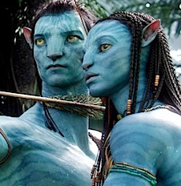

He escrito el mismo post tres veces, y es que tampoco sé muy bien cómo enfocar lo que escribo. Sí, **es una historia muy prototípica** que ya hemos visto o leído un trillón de veces. Pero yo eso no lo veo como un problema, sino más bien como un intento de acercarse al abanico más amplio posible de espectadores, que ya bastante alertados estarán por estar viendo bichos azules en la pantalla como para entrar en rarezas narrativas.

Por otra parte, **técnicamente es impecable**. Producción, realización, dirección, absolutamente todo me parece que esté en su sitio cuando toca, incluso teniendo en cuenta que son casi tres horas de película y que, sí, esta historia tan típica podría haberse contado en la mitad de metraje.

Y **tecnológicamente se mea en todo lo que haya visto hasta hoy** en una pantalla. Sin entrar en tonterías de _marketing_ sobre las posibles nuevas patentes o nuevos inventos que en realidad no son más que juntar muchas cosas que ya se habían utilizado previamente y ya estaban inventadas, he de decir que todas las distintas tecnologías encajan a la perfección entre sí, y llega un momento en el que ya no sabes qué de lo que estás viendo es _CGI_ y qué no. En todas (todas) las películas hay siempre algo que flojea, algo que "canta" y piensas "_ahí se ha notado el chroma_". Aquí no me ha pasado.

Me atrevo a decir algo más acerca de los efectos: menos mal que _Industrial Light & Magic_ ha participado en parte de la película, porque lo que ha conseguido _Weta_ les habría dejado completamente en ridículo si no hubieran conseguido meter su nombre en los créditos. No me queda otra opción que definirla como la primera película realmente fotorealista que se ha hecho.

Generalmente no tengo fenómeno fan con las películas, por más que bromee con las típicas coñas sobre _Star Wars_, _Star Trek_ o _El señor de los anillos_ para seguirles la corriente a todos, pero en este caso algo me está reconcomiendo por dentro y me hace darle vueltas a cada una de las escenas que he visto una y otra vez... y a querer ir a verla de nuevo, esta vez en un IMAX para ver posibles diferencias.

Sé que no es una reseña muy seria, pero qué le voy a hacer... es que me ha gustado.