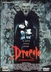

[**Gente de mala calidad**](http://www.imdb.com/title/tt1047870/) (2008)

Si esto es lo mejor (o al menos de lo más publicitado) del cine español, yo creo que antes de decir que está en crisis simplemente deberíamos dejar de darles ayudas y cerrar el chiringuito definitivamente. Atroz. Inaguantable. Si alguien ha pensado en algún momento del proceso de producción que esto realmente era una comedia, merece ser abucheado públicamente en la plaza del pueblo.

**[Asesinato justo](http://www.imdb.com/title/tt1034331/)** (_Righteous Kill_, 2008)

_Robert De Niro_, _Al Pacino_ y _50 cent_. A estas alturas de la vida están los tres más o menos al mismo nivel interpretativo, por más que hayan hecho grandes cosas en el pasado. Bueno, vale, _50 cent_ sólo es un secundario en la película, pero yo quería hacer mi comparación.

Thriller de policías, con alguna mínima gota de erotismo muy, muy controlado (y si contamos que es con _De Niro_, a sus 66 años, da igual quien sea su pareja, corta mucho el rollo). Película bastante obvia, incluso con su giro final que se va haciendo más predecible conforme avanza el metraje. Es lo de siempre.  

**[En qué piensan los hombres](http://www.imdb.com/title/tt1001508/)** (_He's just not that into you_, 2009)

Toma cambio de título... aunque cuenta con un elenco envidiable, es una muestra lamentable de cine _Cosmopolitan:_ _Ben Affleck, Scarlett Johansson, Kevin Connolly, Bradley Cooper, Justin Long, Jennifer Aniston, Jenniffer Connelly, Drew Barrymore_ (que es productora, por cierto) y hasta _Kris Kristofferson_ sufriendo un infarto en diez segundos.

Qué malos son los hombres, tienen la culpa de todos los males del universo por no comprendernos, bla, bla bla... Y el final de la historia de _Ben Affleck_, negando todo aquello que lo conformaba como personaje, y negando el propio argumento central de la película, proporcionando ese príncipe azul que entra en clara contradicción con todo el mensaje que se nos ha intentado meter a la fuerza en el cerebro, no es más que la guinda para una desgracia de producción filmada exclusivamente para deleite de alguna fantasía masturbatoria femenina. Como Crepúsculo, pero sin vampiros.

**[Drácula, de Bram Stoker](http://www.imdb.com/title/tt0103874/)** (_Bram Stoker's Dracula_, 1992) **revisionado**

Pues yo la recordaba mejor, qué queréis que os diga... Tiene sus detalles buenos, especialmente una envidiable actuación de _Gary Oldman_ haciendo de Drácula, pero una mala creación de personajes, de los que no conocemos sus objetivos ni por qué hacen lo que hacen (yo sigo sin saber por qué Drácula fue a Londres), y sobre todo un desarrollo muy lento de lo que va sucediendo, donde la historia parece ir ampliándose sobre la marcha cada vez que parece estar terminando.

Unos efectos visuales curiosos, aunque poca cosa para ser ya del 92, unos efectos especiales lamentables que, por suerte, se limitan a un par de fuegos fatuos azules y poco más, y un uso y abuso de las localizaciones de interior que se nota muchísimo incluso cuando las escenas ocurren en un supuesto exterior.
