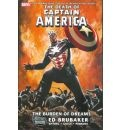

En Diciembre se me pasó el post, así que continúo directamente [desde el de Noviembre](/cincuenta-euros-en-noviembre/). Algunas ideas en las que gastar dinero este mes, basadas en lo que yo he gastado:

En el cine, [una entrada para ver **Avatar**](/avatar-de-james-cameron/) (yo tengo que volver este mes para verla en 3D y ver si hay alguna diferencia... y si me mareo usando unas gafas extrañas).

Y otra compra a [**BookDepository.co.uk**](http://www.bookdepository.co.uk/):

**Daredevil** guionizado por _Ed Brubaker_ y dibujado por _Michael Lark_, que dejé el año pasado harto de que _Panini Comics_ me castigara con horrendos cómics mensuales con un falso dos por uno donde no me interesa la mitad de lo que me venden aunque me obligan a pagar por ello. Sigo ahora con los dos tomos recopilatorios de la saga _Hell to Pay_ (números americanos 94 a 105).

Al cambio viene a salir a casi la mitad de precio por página. ([Hell to pay Vol 1](http://www.bookdepository.co.uk/book/9780785124849/) y [Hell to pay Vol 2](http://www.bookdepository.co.uk/book/9780785128151/)).

Y ya que estaba volviendo a los cómics de _Brubaker_, recordé que también había dejado aparcada su excelente etapa en la colección de **Capitán América**, poco tiempo después de la muerte de su protagonista (y esto no es _spoiler_ ya que salió hasta en los telediarios).

La verdad es que no le veía mucho sentido a seguir leyendo una colección sobre un personaje que ya no sale en la misma... pero recuerdo que todo lo anterior a ese momento era realmente muy bueno, por lo que le concedo una nueva oportunidad de ver al Soldado de Invierno llevando la bandera como traje.

Así que me he hecho con la segunda y tercera sagas que siguen a la muerte del Capitán América: [The Burden of Dreams](http://www.bookdepository.co.uk/book/9780785124245/) y [The Man Who Bought America](http://www.bookdepository.co.uk/book/9780785129714/) (números americanos 31 a 42).

Y el mes que viene más.