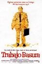
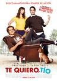
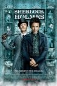

**[Trabajo basura](http://www.imdb.com/title/tt0151804/)** (_Office Space_, 1999) **revisionado**

Tampoco nos vamos a engañar, la película tiene un ritmo irregular, unas actuaciones olvidables y unos personajes cuanto menos estrambóticos, amén de la aparición de una _Jennifer Aniston_ que pasaba por allí cuando empezaba a buscar papeles que la diesen a conocer más allá de _Friends_. Pero si la analizamos desde otro punto de vista, muy personal, es cuando obtenemos algo muy recomendable: si eres informático o afín, o conoces lo suficiente la industria de las nuevas tecnologías como para comprender las situaciones del _film_ más allá de las gracietas rápidas, probablemente te proporcionará un par de momentos impagables.

Además te enseñará dos habilidades básicas: una, a responder "_no es que sea perezoso, es que no me da la gana_" cuando debes. Y dos, el giro de "_la cobra_" aplicado a un jefe tocapelotas, en un gesto en el que lo único que tienes que hacer es seguir andando hacia él y, como si no estuviera allí, rodearlo sin responder a sus frases. Siempre he querido hacer eso en la vida real.

Prescindible para el resto de público, por supuesto.

**[Te quiero, tío](http://www.imdb.com/title/tt1155056/)** (_I love you, man_, 2009)

Pros: _Paul Rudd_ y _Jason Segel_, que siempre me han gustado como actores de comedia. Contras: _Jamie Pressly_ cada día está más vieja. Y sé lo que me digo porque estoy volviendo a ver _Jack & Jill_ y se parecen como la noche y el día. Y _Jon Favreau_ ya no me cuela como actor, se me antoja más clara su carrera como director de cine.

Algún comentario más: _blegh_. Nada del otro mundo.

**[Sherlock Holmes](http://www.imdb.com/title/tt0988045/)** (2009)

Difícil decir nada que no se haya dicho ya. Sí es cierto que es una puesta al día visual, que poco debe al personaje y mucho a _Guy Ritchie_, o a _Fight Club_, si me apuras. El producto final tiene un acabado que asqueará a unos, que sólo se quedarán en el videoclip, y encantará a otros. Como siempre. Naturalmente, se podría haber intentado otra aproximación, pero... la sombra de _House_ es alargada. El alumno se convirtió en el maestro y a mí se me hacía muy difícil distinguir al personaje de _Robert Downey Jr._ del de _Hugh Laurie_ durante el primer cuarto de hora, hasta que, naturalmente, empezaron a llover las _hostias como panes_. Me parece muy difícil centrar al personaje en una investigación sin caer en ser copia de la copia, y de algún modo había que diferenciar productos.

No me gustó sin embargo esa parte de investigación, ese espíritu _Phileas Fogg_ de "_yo lo sé todo en todo momento_" que hace que las cosas sean poco emocionantes. Cuela en _House_ porque hablamos de medicina y, vaya, los mortales no entendemos de medicina, por lo que dejamos que los _palabros_ nos invadan y lleven el argumento... pero me molesta que en uno que sí podría entender no se deje al espectador la posibilidad de haber unido los puntos que forman el dibujo antes que el propio protagonista. Pero esto son más filias personales que problemas reales de la película, supongo.

Es interesante y curiosa. Cuenta con una acertada elección de los actores protagonistas, que parecen conectar muy bien en pantalla, pero con una incorrecta inclusión de un personaje femenino completamente innecesario para toda la historia y sobrada absoluta de presentación del argumento de la siguiente película en un claro "_y de esto irá Sherlock Holmes 2_" como si ya estuviéramos planteando una nueva franquicia de _Batman_.

¿Nadie ha pensado que los derechos de _Sherlock Holmes_ ya son libres y cualquier estudio podría hacer otra película de antes de esa supuesta continuación? No me parece una decisión de márketing muy acertada cuando cualquier empresa puede fabricar merchandising "_levemente_" relacionado, pueden escribir libros, o publicar casi lo que quieran. No se puede utilizar "_este_" _Sherlock Holmes_ pero se puede utilizar el concepto para lo que se quiera. ¿O estoy equivocado al respecto?

**[Lío embarazoso](http://www.imdb.com/title/tt0478311/)** (_Knocked up_, 2007)

Otra peli de _Judd Apatow_, con _Katherine Heigl_ (la _carapan_ de _Anatomía de Grey_) y _Seth Rogen_. Y con casi toda la tropa de actores habituales de _Apatow_. No me ha añadido nada como ser humano y creo que ya he alcanzado el punto en el que los chistes sobre penes y tetas de _Apatow_ me parecen los mismos en todas sus películas. Empecé a hacer _zapping_ y es probable que me perdiera algún trozo de película, y me da igual.

**[Las Crónicas de Narnia: El Príncipe Caspian](http://www.imdb.com/title/tt0499448/)** (_The chronicles of Narnia: Prince Caspian_, 2008)

Una incoherencia de imágenes en movimiento. Con un cuento infantil unos guionistas y directores quieren montar historias épicas de sufrimiento humano. Cuando los protagonistas son cinco niños y las escenas son batallas con centenares de muertos te das cuenta de que algo no fue como debía ir en las reuniones de preproducción. Actores malísimos, efectos horrendos, un nuevo personaje (el príncipe del título) que sobra como personaje y como actor... y una completa incoherencia argumental, por si fuera poco. Un montón de líos que ni el espectador ni los protagonistas comprenden, una guerra cuya finalidad se desconoce, y todo para "perder" pero esperar que un león místico lo solucione todo con sus poderes, en el más grande _deus ex machina_ que nadie se haya atrevido a filmar jamás. Vergonzoso narrativamente hablando. Lo peor que he visto en mucho tiempo.

**[Harry Potter y el Misterio del Príncipe](http://www.imdb.com/title/tt0417741/)** (_Harry Potter and the Half-Blood Prince_, 2009)

No las tenía todas conmigo, porque la serie ha ido en franca decadencia desde la primera iteración de la franquicia (y no es que el inicio ya fuera excesivamente bueno), y en la anterior a esta los límites de absurdidad alcanzados eran espectaculares. Sin embargo me ha sorprendido gratamente: algunos personajes evolucionan por fin; en lugar de darles vueltas a lamentables secundarios de quita y pon, parece que los protagonistas empiezan a relacionarse entre ellos como deberían.

Me gustó mucho que en algún caso incluso los protagonistas hagan cosas por sí mismos, y no gracias a algo mágico que siempre soluciona todo (vaya, hasta _Ron_ lo hace bien en el _Quidditch_, y no gracias a ninguna pócima mágica). Y me gustó mucho que los secundarios por fin hagan algo más que ser profesores, aunque gracias a la [_camiseta spoiler_](http://www.threadless.com/product/844/Spoilt) ya sabía de antemano lo que iba a pasar desde hace años.

Por fin se consigue oscurecer un poco el tono (no sólo a la imagen como en anteriores películas), y por fin parece que los personajes hacen cosas coherentes... supongo que más gracias a que los actores parecen alumnos de universidad en vez de colegiales, pero probablemente sea un efecto colateral positivo.

Pero vaya, que me ha gustado lo suficiente, así incluso puedo arriesgarme a ver la(s) última(s). Voy adelantándole al mundo que no pienso volver a picar con películas que no terminan, por si realmente la última película va a ir en dos partes como parecía que se había acordado (_Matrix, Kill Bill, Piratas del Caribe_... en serio, lo de partir algo en dos partes y pretender que esperemos un año entre una y otra me sobra y no las pienso ver hasta que estén las dos).